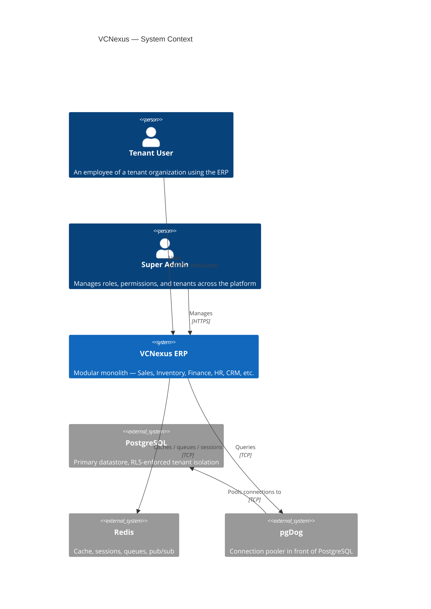
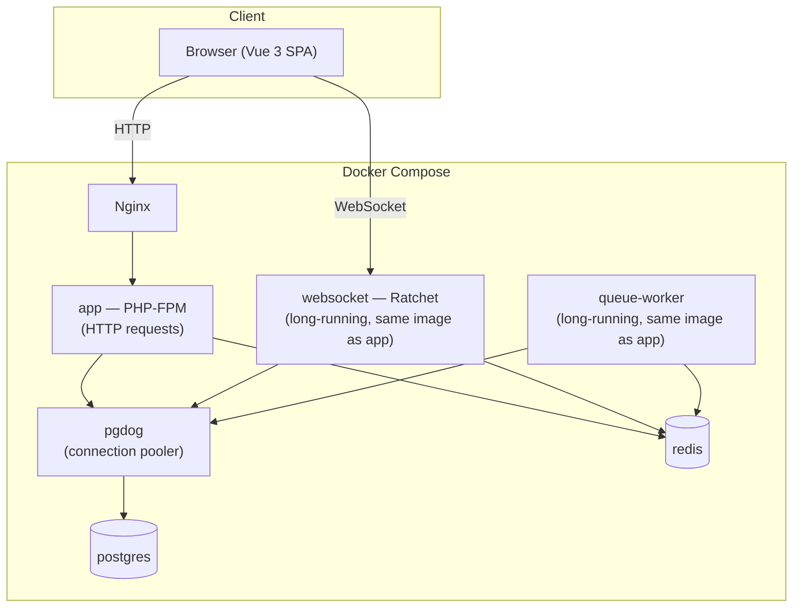

# System Overview & Architecture

## What VCNexus Is

VCNexus is a multi-tenant ERP: multiple independent organizations (tenants) share one deployed application and one database, with strict data isolation between them. It's built as a **modular monolith** — one codebase and one deployable unit, internally organized into business modules with real boundaries, rather than either a single undifferentiated codebase or a microservices split.

## System Context

## Why a Modular Monolith — Not Microservices, Not a Flat Codebase

This is the foundational decision everything else in this document builds on, so it's worth stating the reasoning explicitly rather than just the conclusion.

**The trade-off space:**

| Approach | What it buys | What it costs |
|---|---|---|
| Flat/unstructured monolith | Fastest to start | Becomes unmaintainable as modules (Sales, Inventory, Finance...) grow and entangle |
| Microservices | Independent scaling, deployment, team ownership | Network calls replace function calls, distributed transactions, operational overhead — none of which this project needs yet |
| **Modular monolith (chosen)** | Real module boundaries, one deploy, one transaction model, no network overhead between modules | Requires discipline to keep boundaries honest — nothing stops a module from reaching into another's internals except convention |

**Why this fits VCNexus specifically:** an ERP's modules (Sales, Inventory, Finance) are **transactionally coupled** — creating a sales order touches inventory and finance atomically, in one database transaction (see [Backend Conventions](02-backend-conventions.md) for how this is implemented). Microservices would turn every one of these into a distributed transaction problem (sagas, eventual consistency, compensating actions) for no benefit at this scale. A modular monolith keeps `StartTrans()`/`CompleteTrans()` working across module boundaries while still preventing the "everything touches everything" entanglement of a flat codebase, via enforced folder boundaries and a dependency direction module authors are expected to respect.

**The escape hatch is deliberate:** if a specific module (e.g., the Realtime/WebSocket layer, or a future high-volume module) ever needs independent scaling, the module boundaries already in place make extracting it into its own service possible later — without having paid the distributed-systems tax from day one for modules that never needed it.

## Container Architecture

**Design decision — three PHP processes, one image.** `app`, `websocket`, and `queue-worker` are three separate Docker Compose services, but all three build from the *same* PHP image/Dockerfile — they differ only in their startup command (`php-fpm` vs. `php bin/websocket-server.php` vs. `php bin/queue-worker.php`). This means zero code duplication between them, while keeping their very different failure/scaling characteristics isolated: a stuck queue job doesn't take down open WebSocket connections, and a WebSocket server crash doesn't affect HTTP request handling. See [Request Flow & Realtime](06-request-flow-realtime.md) for the full reasoning.

## Tech Stack

| Layer | Choice | Why |
|---|---|---|
| Runtime | Docker (multi-container) | Isolates services, matches production topology in dev |
| Backend | PHP 8.4, no framework | Full control over the request lifecycle; framework conventions (routing, DI, middleware) built explicitly and kept small — see [Backend Conventions](02-backend-conventions.md) |
| Database | PostgreSQL + Row-Level Security | Tenant isolation enforced at the database layer, not only in application code — see [Multi-Tenancy](03-multi-tenancy.md) |
| DB Access | ADOdb, pooled via pgDog | ADOdb for a stable, framework-agnostic DB abstraction; pgDog for connection pooling under load |
| Cache / Sessions / Queues | Redis | Sessions, `PermissionCache`, job queue, and WebSocket pub/sub all share one service |
| Frontend | Vue 3 + TailwindCSS | Component-based SPA, utility-first styling |
| Realtime | Ratchet | WebSocket server, same PHP codebase as the HTTP app |

## The Core Design Principle

> Keep one application, but don't let everything depend on everything else.

Every other document in this set is an elaboration of this one sentence — module boundaries (`src/Modules/`), the shared-vs-module-specific rules for attributes and base classes, the dependency-injection container, and the tenant-isolation model all exist to make "everything depends on everything" structurally hard to do by accident, without paying for a distributed system.

## Where to Go Next

- [Project & Module Structure](01-project-structure.md) — the actual folder layout and what goes where
- [Backend Conventions](02-backend-conventions.md) — layers, transactions, dependency injection
- [Multi-Tenancy & Connection Pooling](03-multi-tenancy.md) — the RLS model and how tenant context flows through a request
- [Business Modules](04-business-modules.md) — what each module owns
