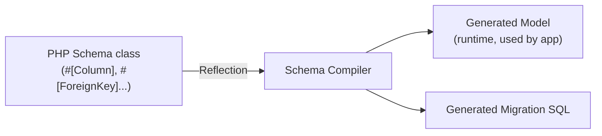
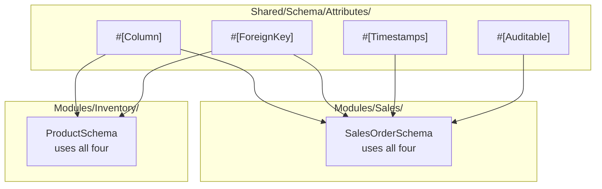

# Project & Module Structure

## Folder Layout

```text
src/
├── Modules/              # Business logic — one folder per domain
│   └── <Name>/
│       ├── Controllers/    # One per resource, not per module (see below)
│       ├── Services/         # Business rules, transactions, cross-module coordination
│       ├── Repositories/       # ADOdb queries — the only layer that touches SQL
│       ├── Models/               # Generated from schemas — mirrors the DB row
│       ├── DTOs/                   # Request/response shaping
│       ├── Validators/               # Input validation, array → DTO
│       └── Exceptions/                 # Module-specific business-rule failures
│
├── Shared/                # Cross-cutting infrastructure — no dependency on Modules/
│   ├── Schema/               # Attributes (#[Column], #[ForeignKey]...) + the compiler's reader
│   ├── Http/                    # Request, Response, MiddlewareInterface, attributes
│   ├── Domain/                     # BaseService, BaseRepository, DataTransferObjectInterface
│   ├── Container/                    # The dependency-injection container
│   └── Exceptions/                     # AppException base + infrastructure-level exceptions
│
├── Infrastructure/         # Concrete connections — Database, Redis, Mail, Storage
├── Realtime/                 # Ratchet WebSocket server
└── Bootstrap/                   # Application entry point, Router, MiddlewarePipeline

schemas/                  # PHP schema classes — source of truth for every table
tools/schema-compiler/      # Reads schemas/ → generates database/migrations/ + src/Modules/*/Models/
database/migrations/          # Generated SQL — tables/ and constraints/ (see below)

frontend/
├── src/
│   ├── i18n/               # Per-domain, per-locale translation files
│   ├── composables/           # Reusable stateful behavior (not app-wide state)
│   ├── services/                 # Module-specific API calls, built on a generic HTTP composable
│   ├── stores/                      # Pinia — genuinely shared app state only
│   └── views/                          # One folder per module, mirrors backend

docker/                   # Per-service Dockerfiles and config
secrets/                    # Never committed — organized by concern (database/, redis/, jwt/, fiscal/)
```

## Design Decision: Schema-First, Compiler-Generated Models



A schema class (`schemas/Sales/SalesOrderSchema.php`) is the single source of truth for a table's shape — columns, keys, indexes, expressed as PHP attributes. The compiler reads it via Reflection and produces two independent artifacts: the runtime `Model` class the application actually works with, and the migration SQL that creates the table. Neither is hand-maintained; both regenerate from the schema.

**Why not hand-write migrations directly:** keeping one definition (the schema) as the source of truth means a column can never drift between "what the Model expects" and "what the database actually has" — both are derived from the same attributes in the same Reflection pass.

**Why migrations split into `tables/` and `constraints/`:** foreign keys create a dependency order problem — a `sales_orders` migration referencing `customers` fails if `customers` doesn't exist yet. Rather than computing a topological sort across every schema (real complexity, and still breaks on circular references), every `CREATE TABLE` migration omits foreign keys entirely; a second phase adds every `ALTER TABLE ... ADD CONSTRAINT` afterward, once all tables unconditionally exist. Table creation order becomes irrelevant.

## Design Decision: Attributes Are Shared Infrastructure, Not Per-Module



The test applied throughout: **does the attribute describe storage shape, or a business rule?** `#[Column]`, `#[ForeignKey]`, `#[Timestamps]`, `#[Auditable]` describe *how a table is structured* — identical regardless of which module owns the table — so they live once, in `Shared/`, and every module's schemas reuse them. A genuine business rule (e.g., a hypothetical `#[RequiresApproval]`) stays inside the module it belongs to. This same test governs interfaces, base classes, and exceptions throughout the codebase — see [Backend Conventions](02-backend-conventions.md).

`#[Timestamps]` and `#[Auditable]` are two separate attributes rather than one combined attribute, because they need different inputs to resolve: `created_at`/`updated_at` need only the current time; `created_by`/`updated_by` need the authenticated user, which isn't available for system-generated writes (a scheduled job, a migration). Keeping them separate means a table can opt into one without the other.

## Design Decision: One Controller Per Resource

```text
Modules/Sales/Controllers/
├── QuoteController.php
├── SalesOrderController.php
└── InvoiceController.php
```

Not one `SalesController` handling all three. Each is a distinct REST resource with independent validation, state transitions, and HTTP verbs — a single fat controller per module recreates the "God object" problem the module split was meant to avoid, just one level down. Cross-resource coordination (a sales order triggering inventory and finance updates) belongs in the **Service** layer, not in controllers calling each other.

## Design Decision: Secrets, Organized by Concern

```text
secrets/
├── database/     db_password.txt, db_replica_password.txt
├── redis/          redis_password.txt
├── jwt/               signing_key.pem, public_key.pem
├── fiscal/              certificate.pfx, certificate_password.txt   ← isolated: highest-stakes secret in the project
└── .env.example           ← the ONLY committed file
```

Splitting by concern (rather than one flat folder) enables least-privilege mounting in Docker Compose — the mail worker container never needs, and never receives, `database/db_password.txt`. `fiscal/` gets its own folder specifically because a leaked NF-e signing certificate is a legal/compliance problem, not just an infrastructure one.

Both `.gitignore` and `.dockerignore` exclude `secrets/` — deliberately in both files, since they block two different leaks: git history, and a Docker image layer (a stray `COPY . .` in any Dockerfile would otherwise bake secrets permanently into an image).

## Where to Go Next

- [Backend Conventions](02-backend-conventions.md) — how the layers in `Modules/*/` actually work together
- [Multi-Tenancy](03-multi-tenancy.md) — how `#[Column]`/schemas connect to Row-Level Security
