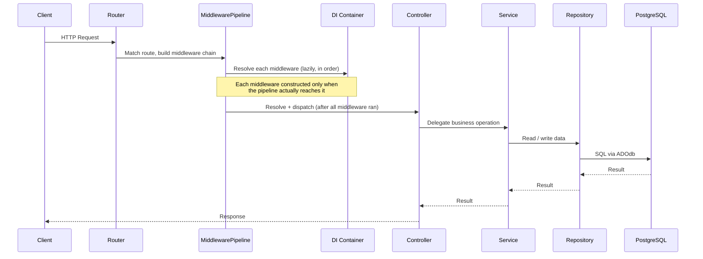
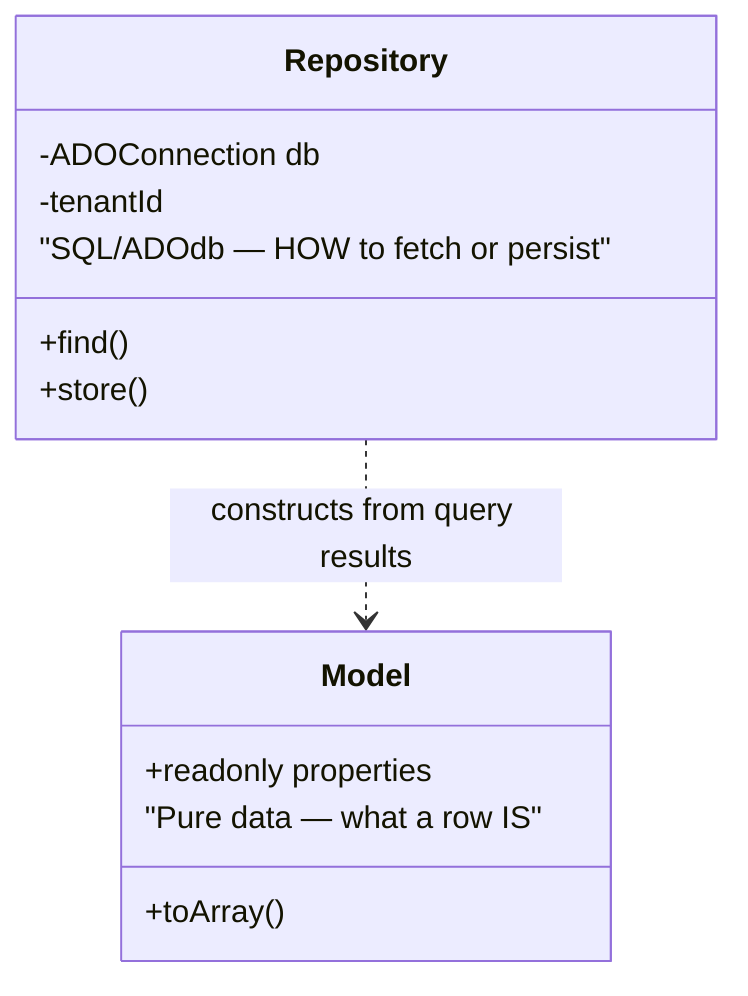
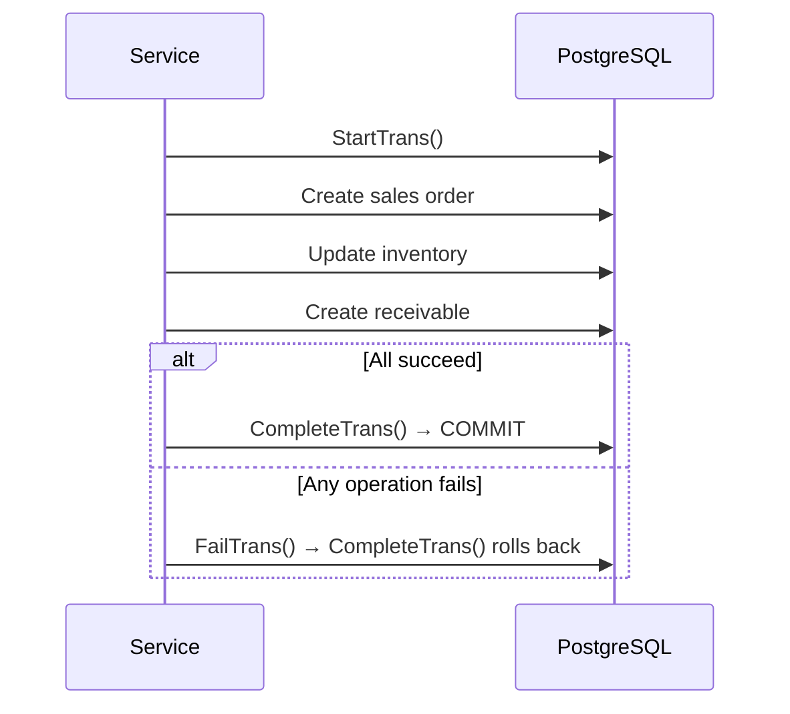
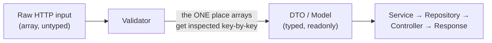
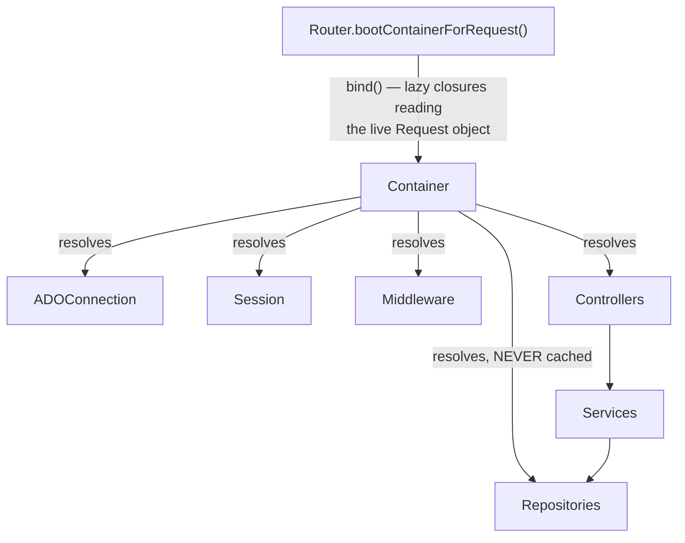
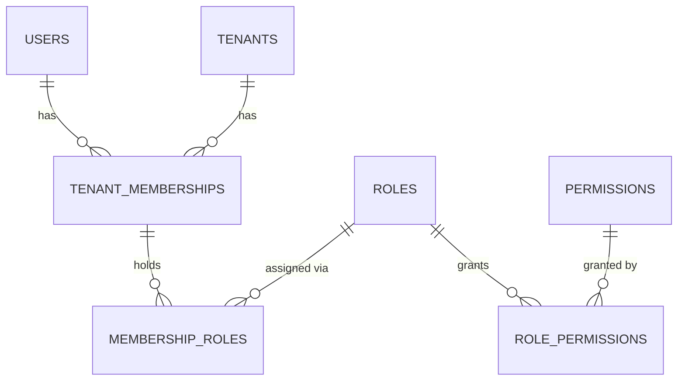

# Backend Conventions

## The Request Lifecycle



**Design decision — layers, not shortcuts.** A Controller never talks to a Repository directly for anything that writes data or coordinates more than one table. The Service layer exists specifically to hold `StartTrans()`/`CompleteTrans()` transaction boundaries and cross-module coordination — a Controller calling `StartTrans()` itself would mean transaction logic scattered across every entry point instead of centralized in one place. The one exception: a genuinely trivial, single-table read with no business logic may skip the Service, the same way a class with no reusable behavior doesn't need a base class.

## The Model vs. Repository Split



A Model has no idea how it was fetched or how to save itself — it's a plain, typed data holder. The Repository is the only thing that knows SQL. This split matters concretely here because Models are **compiler-generated** (regenerated whenever a schema changes) — if fetch/save logic lived on the Model, every hand-written query would be wiped on the next compile. Keeping that logic in a separate, hand-written Repository means the compiler only ever owns the Model file.

## Transactions



ADOdb's `StartTrans()`/`CompleteTrans()`/`FailTrans()` pattern wraps a multi-step business operation (e.g., creating a sales order touches Sales, Inventory, and Finance) in one atomic transaction, centralized in `BaseService::transactional()` so every Service gets this behavior without reimplementing it.

## Typed Objects, Not Arrays — Past the Validation Boundary



Once data crosses a Validator, it never goes back to being an array. `function create(array $data): array` is treated as a code smell; the correct shape is `function create(CreateOrderDTO $data): SalesOrder`. Arrays stay legitimate in three places: raw HTTP input before validation, ADOdb's native recordset handling inside a Repository (mapped to a Model once, at the boundary), and genuinely schemaless data (e.g., forwarding a raw webhook payload).

## Dependency Injection



**Design decision — a small Reflection-based container, not a framework DI library.** Given the project's "no framework, explicit wiring" premise, a ~100-line container that resolves a class's dependencies via constructor Reflection fits the same philosophy: explicit, traceable, no hidden magic. `bind()` is the escape hatch for anything Reflection can't infer on its own — an interface needing a specific implementation, or a value needing live request context.

**Design decision — Repositories are never cached by the Container.** This was a real bug worth documenting: a Repository built early in the request (e.g., as a dependency of an authentication check, before the tenant is resolved) would, if cached, silently leak its empty tenant context into every later consumer of that same class — including code that runs *after* the real tenant is known. Excluding anything extending `BaseRepository` from the instance cache means every consumer gets a fresh Repository reflecting whatever tenant/user context is live *at the moment it's constructed*, not whatever the first caller happened to see.

**Design decision — bindings read live request state via closures, not snapshotted values.** `bind('tenantId', fn() => $request->attribute('tenantId'))`, not `bind('tenantId', $someVariable)`. The former re-reads the `Request` object's current attributes every time it's resolved; the latter freezes whatever value existed at the moment `bind()` was called — which is before most middleware has run. This is the same principle as the Repository-caching decision: request-scoped values must never be captured earlier than the point they're actually needed.

## Roles & Permissions (RBAC)



Roles and permissions are never columns on `users` — a `role` string can't express one user holding multiple roles, can't be added to without a migration, and can't be reused across users without duplication. `tenant_memberships` records *whether* a user belongs to a tenant (independent of role — representing a real state: "invited, not yet configured"); `membership_roles` records *which* role(s) that membership holds, many-to-many, since a user can hold more than one role in the same tenant.

Permissions are a fixed catalog derived from code (`#[RequiresPermission('sales.orders.approve')]` attributes), not admin-creatable — this keeps the permission catalog from drifting out of sync with what's actually enforced. Roles are freely admin-editable bundles of that fixed permission set. Resolution (`user → memberships → roles → permissions`) is cached in Redis, invalidated on role/membership change, since it's a multi-hop join otherwise repeated on every permission check.

## Exceptions

```text
Shared/Exceptions/AppException          — base class every custom exception extends
Modules/<Module>/Exceptions/               — business-rule failures (module-specific)
Shared/Exceptions/, or colocated              — infrastructure failures (cross-cutting) or
                                                 single-class-owned (e.g. RouteNotFoundException next to Router)
```

Every tier extends the same `AppException` base — a single catch point in the application entry point turns any of them into a consistent JSON error response, without needing to know which specific exception type it caught.

## Where to Go Next

- [Multi-Tenancy](03-multi-tenancy.md) — how `tenantId` actually reaches the database connection
- [Business Modules](04-business-modules.md) — how these layers compose per module
