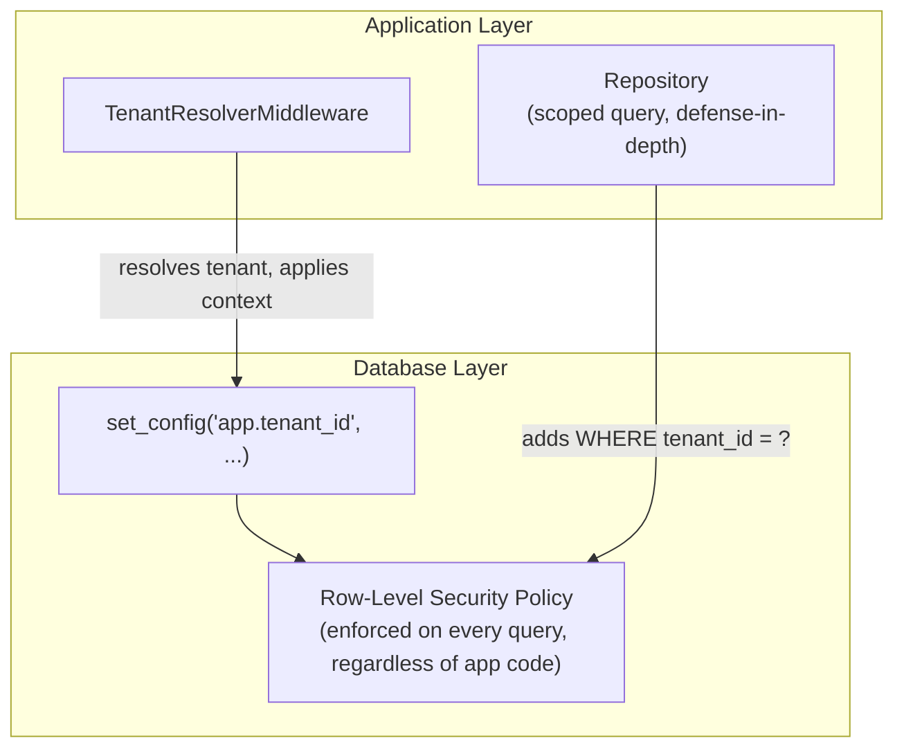
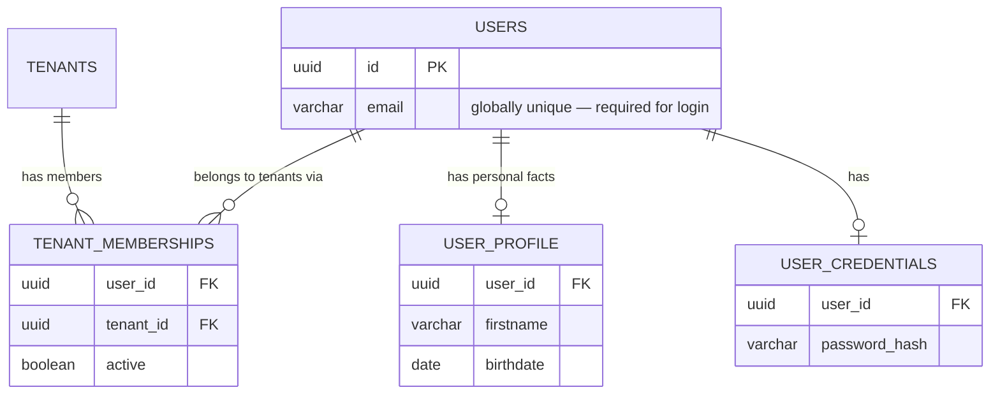
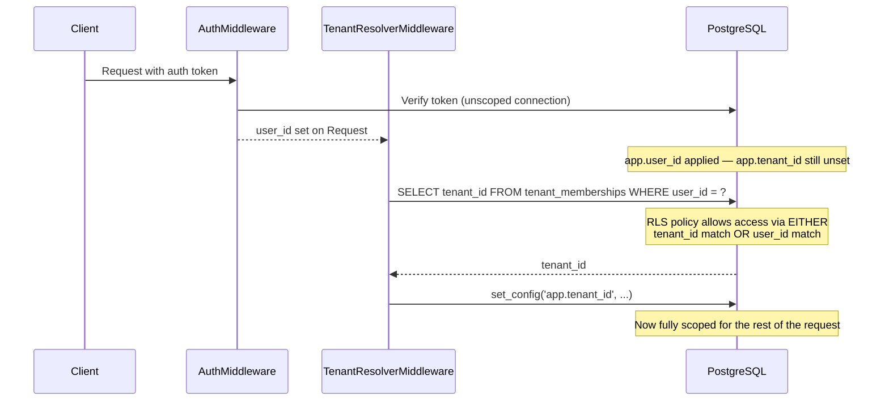
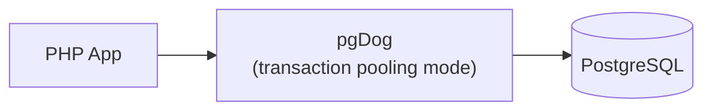

# Multi-Tenancy & Connection Pooling

## The Isolation Model



**Design decision — defense in depth, not RLS alone.** RLS is the primary enforcement: even if application code forgets a `WHERE tenant_id = ?`, the database itself refuses to return rows outside the current tenant. But RLS's correctness depends entirely on `set_config()` having actually run, on the exact connection a query executes on — a real risk given connection pooling (see below). Repositories additionally append an explicit `tenant_id` filter as a second, independent layer, so a misconfigured RLS policy or a missed `ENABLE ROW LEVEL SECURITY` on a new table doesn't silently expose cross-tenant data.

## Tenant Data Model



**Design decision — `users` (and personal-fact tables like `user_profile`) carry no `tenant_id` at all.** A person can belong to more than one tenant, and login has to find a user by email *before* any tenant is known — a table that must stay tenant-agnostic for that lookup can't also be the thing RLS scopes by. Tenant membership lives in a separate join table (`tenant_memberships`) instead; RLS applies there, not on `users` itself. Credentials are split into their own table (`user_credentials`) rather than a column on `users`, so the identity table — read on nearly every authenticated request via `#[ForeignKey]` references from other modules — never carries a password hash into memory unnecessarily.

## Resolving the Tenant: The Chicken-and-Egg Problem

The hard part: `TenantResolverMiddleware` needs to query `tenant_memberships` to find out which tenant a user belongs to — but that query itself would be blocked by RLS if RLS only allows `tenant_id`-matched rows, since the tenant isn't known yet.



**Design decision — the RLS policy on `tenant_memberships` allows access by `user_id` as well as `tenant_id`:**

```sql
CREATE POLICY tenant_memberships_access ON tenant_memberships
USING (
    tenant_id = current_setting('app.tenant_id', true)::uuid
    OR user_id = current_setting('app.user_id', true)::uuid
);
```

This resolves the chicken-and-egg problem without bypassing RLS or introducing a second database role: `app.user_id` is set by `AuthMiddleware`, *before* `TenantResolverMiddleware` runs — so the lookup "which tenants does this user belong to" is naturally covered by the `user_id` clause, while normal tenant-scoped operations continue to rely on the `tenant_id` clause. `current_setting(..., true)` returns `NULL` rather than erroring when unset, and `NULL` never satisfies an equality check — so an unauthenticated request (`app.user_id` also unset) sees no rows, failing closed rather than open.

## Connection Pooling with pgDog



**Design decision — session-scoped context is unsafe under transaction pooling; re-apply on every use.** pgDog's transaction-pooling mode hands a physical connection back to the pool at the end of each transaction — meaning the *next* transaction on that same physical connection could belong to a completely different tenant. If tenant context is applied once and assumed to persist, a pooled connection can silently leak one tenant's `app.tenant_id` into another tenant's queries.

The fix implemented here: tenant/user/role context is re-applied via `set_config(..., ..., true)` (transaction-local scope) at the start of **every** transaction a Repository runs — not once per request, not cached across calls. This was discovered directly during development: an earlier version applied context once per `ConnectionProvider::get()` call and cached the resulting connection, which under pgDog's pooling produced exactly the cross-tenant leakage this design describes. The fix — reapplying context inside every `scopedQuery()` call, immediately after `StartTrans()` — closes that gap.

## Where to Go Next

- [Backend Conventions](02-backend-conventions.md) — how tenant context flows through the DI container
- [Business Modules](04-business-modules.md) — which modules' tables are tenant-scoped
