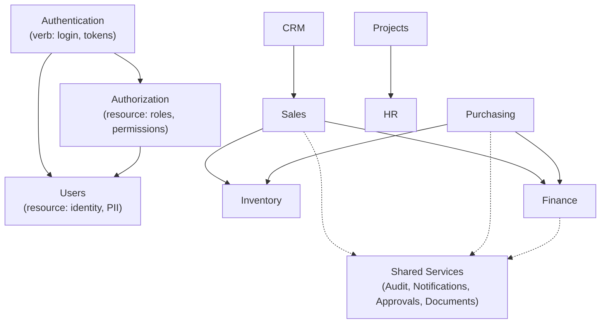
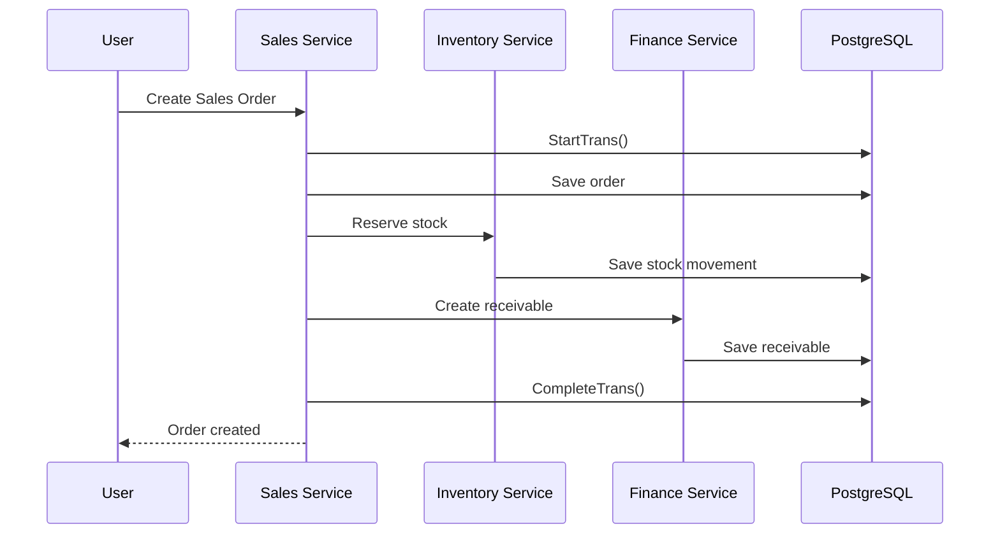
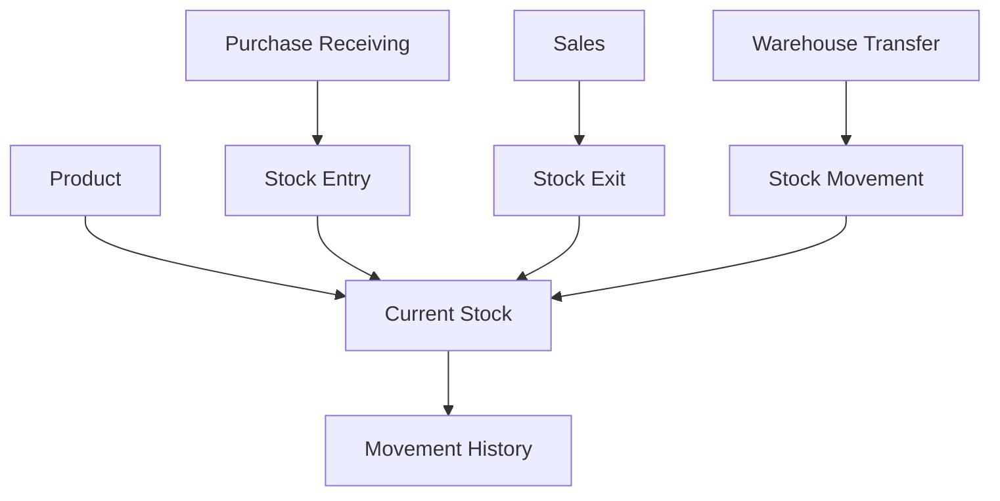

# Business Modules

## Module Map & Dependency Direction

**Design decision — Authentication, Users, and Authorization are three separate modules, not one.** They're easy to conflate because they all sit near "login," but they answer different questions: Authentication is a *verb* (proving a credential is valid, right now); Users and Authorization are *resources* (who someone is; what they're allowed to do) — with their own CRUD, listing, and sensitive-data handling. Authentication depends on both; neither depends back on it. This keeps permission naming honest (`users.list`, `auth.login` gate genuinely different things) and means a future admin screen for managing roles or users is ordinary module work, not something bolted onto the auth flow.

## Module Scope

| Module | Owns | Depends on |
|---|---|---|
| **Authentication** | Login/logout, token issuance, password reset, login-attempt tracking | Users, Authorization |
| **Users** | Identity (`users`), personal profile data, PII | — |
| **Authorization** | Roles, permissions, tenant memberships, role assignment | Users |
| **CRM** | Leads, opportunities, activities | — |
| **Sales** | Quotes, sales orders, invoices | Inventory, Finance, People/Users |
| **Purchasing** | Purchase requests, supplier orders, receiving | Inventory, Finance, Approvals |
| **Inventory** | Products, warehouses, stock movements | — |
| **Finance** | Receivables, payables, cash accounts, reconciliation | — |
| **Projects** | Projects, tasks, timesheets | HR |
| **HR** | Employees (Workers), attendance, departments | Users |
| **Shared Services** | Audit trail, notifications, approvals, document attachments | Used by every module above |

## Sales — Cross-Module Coordination Example

One Service method, one transaction, three modules coordinated through direct method calls — not events, not sagas. This is the concrete payoff of the modular-monolith decision in [Overview & Architecture](00-overview-architecture.md): a distributed version of this same operation would need a saga pattern and eventual consistency for no actual benefit at this scale.

## Inventory — Movement-Driven, Not a Bare Quantity

Stock changes are always recorded as a **movement** (entry, exit, transfer, adjustment) rather than an in-place quantity update — this preserves a full audit trail and lets "current stock" be derived rather than trusted as the only source of truth.

## Deferred: Async Side Effects via Events + Queue

```mermaid
flowchart LR
    SERVICE["UserService.create()"]
    EVENT["UserWasCreated event"]
    DISPATCHER["EventDispatcher"]
    LISTENER["SendWelcomeEmailListener"]
    QUEUE["Redis Queue"]
    WORKER["queue-worker process"]

    SERVICE -->|dispatches| EVENT
    EVENT --> DISPATCHER
    DISPATCHER -->|queueable| LISTENER
    LISTENER -->|pushes job| QUEUE
    QUEUE --> WORKER
    WORKER -->|sends email| EMAIL["Email"]
```

Side effects that shouldn't block the HTTP response (sending a welcome email, notifying an integration) go through this path rather than running inline in the Service. A Service dispatches a plain event object and never knows what listens to it — adding a second listener (e.g., a Slack notification on user creation) means writing a new listener class, with zero changes to `UserService`. See [Request Flow & Realtime](06-request-flow-realtime.md) for the worker process this depends on.

## Where to Go Next

- [Worked Examples](07-worked-examples.md) — the full Sales and Purchasing flows end to end
- [Multi-Tenancy](03-multi-tenancy.md) — how these modules' tables are tenant-isolated
