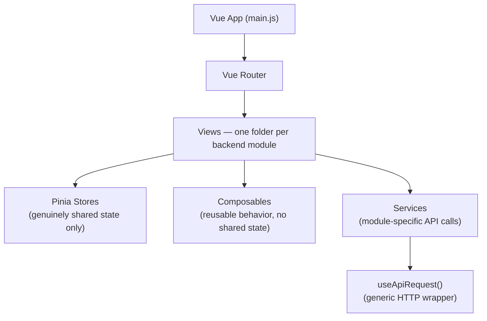
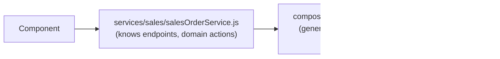

# Frontend Architecture

## Structure



## Design Decision: Composables vs. Stores vs. Services

| | Shared across components? | Holds |
|---|---|---|
| **Composable** | No — each caller gets a fresh instance | Reusable *behavior*: pagination, debounced search, form validation |
| **Pinia store** | Yes — one instance app-wide | Genuinely shared state: current user, current tenant |
| **Service** | N/A | Module-specific API calls — endpoints, domain actions (`approve()`, not just CRUD) |

The distinction that matters most: a composable is for logic reused across components that each need their *own* copy of the state (two independent paginated lists shouldn't share a page number); a store is for state that must be one single source of truth everywhere it's read.

## Design Decision: Generic HTTP Wrapper vs. Per-Module Services



`useApiRequest()` knows nothing about Sales, Invoices, or any domain shape — just HTTP mechanics (loading state, error normalization, attaching auth/tenant headers once via an interceptor). Each module's `services/<module>/` file is where the module actually lives on the frontend. If axios is ever swapped for `fetch`, or tenant-header handling changes, one file changes instead of every module's services.

## Design Decision: Lazy-Loaded, Per-Domain i18n

```text
i18n/
├── locales/shared/      # cross-cutting strings: buttons, validation
└── modules/
    ├── sales/{en-US,pt-BR}.json
    └── inventory/{en-US,pt-BR}.json
```

Translation files are merged in lazily, per module, as that module's view loads — rather than bundling all modules' strings into the initial payload. Full locale tags (`pt-BR`, not `pt`) from the start, since the fiscal module ([Fiscal Module](08-fiscal-module.md)) will need Brazil-specific formatting eventually.

## Where to Go Next

- [Business Modules](04-business-modules.md) — the backend modules these views mirror
