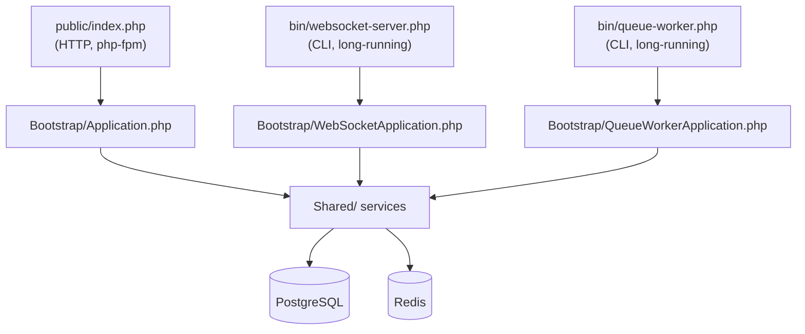
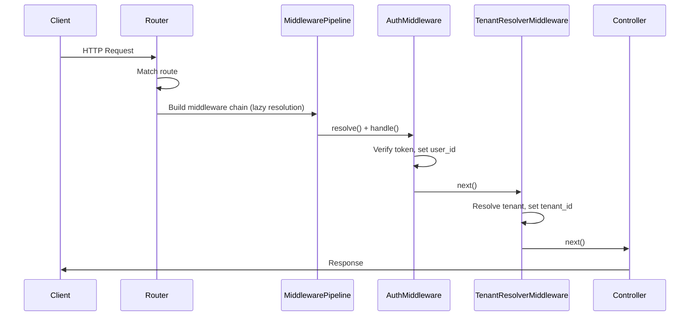
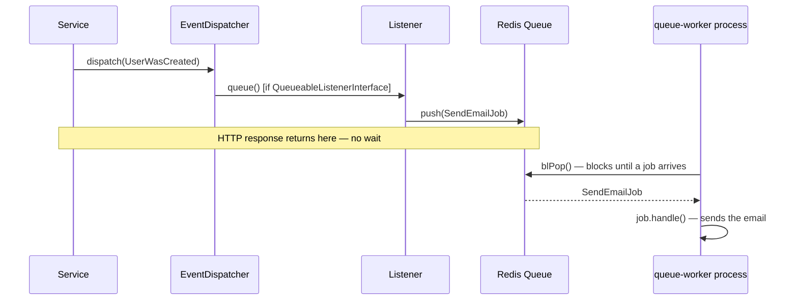

# Request Flow & Realtime

## Two Entry Points, One Codebase

**Design decision — a WebSocket server and a queue worker are new entry points into the same codebase, not separate services.** Both need the same `Shared/Notifications/`, `Shared/Http/` auth, and `Shared/Schema/` models as the HTTP app. Splitting them into separate repositories would mean duplicating that shared code or building an internal API just to re-access it — real cost for no benefit at this stage. Each is built from the *same* Docker image as the HTTP app, started with a different command (`php bin/websocket-server.php` instead of `php-fpm`).

**When this would change:** if the realtime layer ever needs to scale independently of HTTP traffic (thousands of persistent WebSocket connections while HTTP load stays modest), that's the point to reconsider extracting it — and the module boundaries already in place ([Overview & Architecture](00-overview-architecture.md)) make that possible without a rewrite.

## HTTP Request Pipeline

**Design decision — middleware is resolved lazily, one step at a time, not all upfront.** Building every middleware instance before the pipeline starts executing means a later middleware's dependencies (e.g., something needing a tenant-scoped database connection) can get constructed *before* an earlier middleware (like `TenantResolverMiddleware`) has actually run — silently locking in an incorrect, pre-tenant state. Resolving each middleware only when the pipeline reaches its turn guarantees every earlier step has already executed first.

## Queue-Backed Events

A Service dispatches a plain event object without knowing what (if anything) listens to it. Side effects that shouldn't block the HTTP response — email, external notifications — go through a `QueueableListenerInterface`, which pushes a small job onto Redis rather than executing inline. The `queue-worker` process (same image as the HTTP app, per the two-entry-points decision above) blocks on Redis (`blPop`) waiting for jobs, rather than polling in a tight loop.

## Where to Go Next

- [Business Modules](04-business-modules.md) — where events get dispatched from
- [Worked Examples](07-worked-examples.md) — a full Sales flow, including its transaction boundaries
