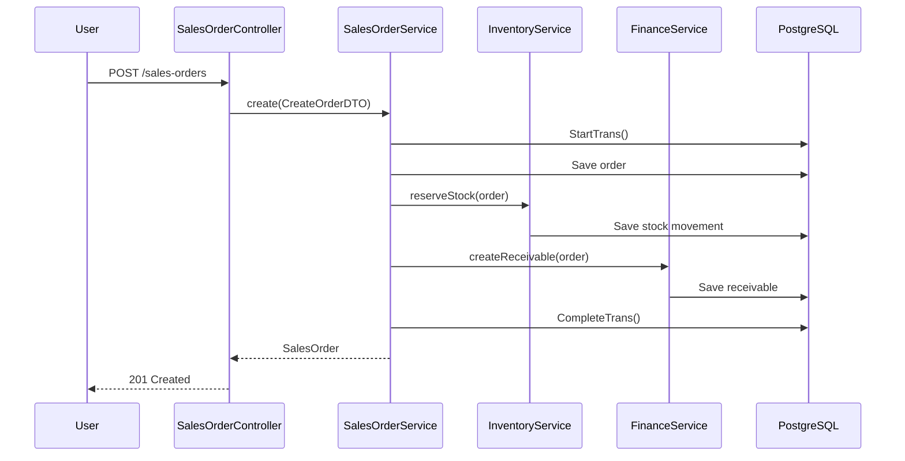
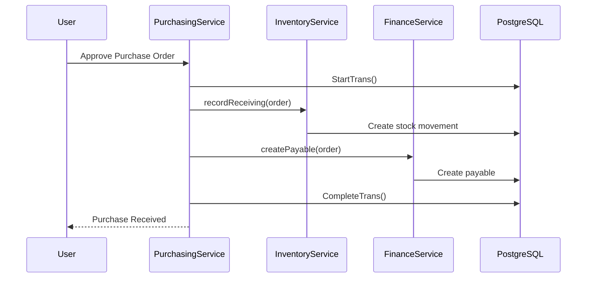

# Worked Examples

These trace a request end to end through every layer described in [Backend Conventions](02-backend-conventions.md) and [Multi-Tenancy](03-multi-tenancy.md), to show how the pieces actually compose.

## Sales Order Creation

**What this demonstrates:**
- The Controller stays thin — one call into the Service, no business logic.
- One `StartTrans()`/`CompleteTrans()` boundary spans three modules (Sales, Inventory, Finance) via direct method calls — the transactional payoff of the modular-monolith decision.
- If any step throws, `FailTrans()` rolls back the entire operation, including the stock movement and receivable — never a partially-applied order.

## Purchase Order Receiving

Mirrors the Sales flow in shape — same transaction pattern, same cross-module coordination style, different modules involved (Inventory + Finance instead of Inventory + Finance from the sales side). This consistency is deliberate: once a developer understands one cross-module transaction, every other one in the codebase follows the same shape.

## Where to Go Next

- [Business Modules](04-business-modules.md) — the scope of each module involved here
- [Multi-Tenancy](03-multi-tenancy.md) — how every query in these flows stays tenant-scoped
