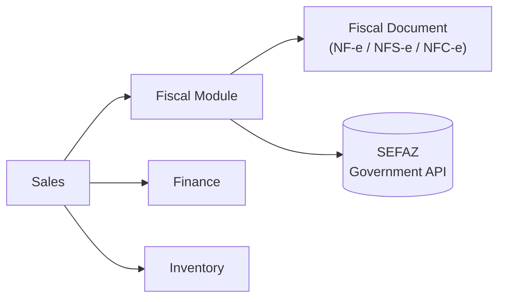

# Brazilian Fiscal Module (Future)

## Scope

NF-e, NFS-e, NFC-e, and SEFAZ integration — invoicing compliance for operating in Brazil. Not part of the initial build.

## Why This Is Its Own Module, Not Folded Into Sales or Finance

Fiscal document generation is complex enough — different document types per transaction type, government API integration, digital certificate signing — to deserve its own boundary rather than being scattered across the modules that trigger it. Sales creates the business transaction; Fiscal reacts to it (likely via the event/queue pattern in [Request Flow & Realtime](06-request-flow-realtime.md)) to generate and submit the compliant document.

## Security Note

The digital certificate used to sign fiscal documents is the highest-stakes secret in this project — a leaked signing certificate is a legal and compliance problem, not just an infrastructure one. It gets its own isolated folder under `secrets/fiscal/`, separate from every other credential (see [Project & Module Structure](01-project-structure.md)).

## Status

Not started. Build order and prerequisites are tracked in the [Roadmap](09-roadmap.md).
