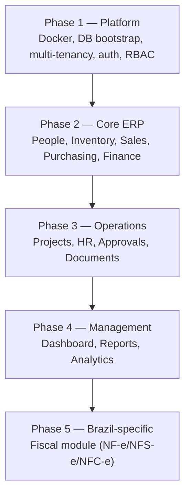

# Roadmap

## Build Order

Each phase depends structurally on the one before it: Sales and Purchasing (Phase 2) need working multi-tenancy and RBAC (Phase 1) before a single order can be safely created; Reports (Phase 4) need real transactional data (Phase 2) to report on.

### Phase 1 — Platform
Docker environment, database bootstrap ([Project & Module Structure](01-project-structure.md)), the schema compiler, multi-tenancy and RLS ([Multi-Tenancy](03-multi-tenancy.md)), Authentication/Users/Authorization modules, the DI container ([Backend Conventions](02-backend-conventions.md)).

### Phase 2 — Core ERP
People/Users, Products, Inventory, Sales, Purchasing, Finance — see [Business Modules](04-business-modules.md) for scope.

### Phase 3 — Operations
Projects, Employees/HR, Approvals, Documents.

### Phase 4 — Management
Dashboard, Reports, Analytics, Import/Export.

### Phase 5 — Brazil-Specific
See [Fiscal Module](08-fiscal-module.md).

**Future modules**, added only on real demand: Accounting, Payroll, Manufacturing, Fleet, Helpdesk.

## First Steps

1. Scaffold Docker (`nginx`, `php-fpm`, `postgres`, `pgdog`, `redis`)
2. Bootstrap the PHP entry point — front controller, router, autoloader
3. Set up ADOdb + the DI container
4. Enable RLS from the very first migration — retrofitting tenant isolation later is far more painful than building it in from day one
5. Scaffold Vue (Vite + Vue 3 + Tailwind + Pinia)
6. Build Phase 1 (Platform) completely before touching any ERP module — every later module depends on auth, tenancy, and RBAC being solid
7. Build one vertical slice (Sales) end to end — Controller → Service → Repository, with a real transaction — before replicating the pattern across other modules

## The Guiding Principle

> Keep one application, but don't let everything depend on everything else.

See [Overview & Architecture](00-overview-architecture.md) for the full reasoning behind this decision and what it costs versus what it buys.
