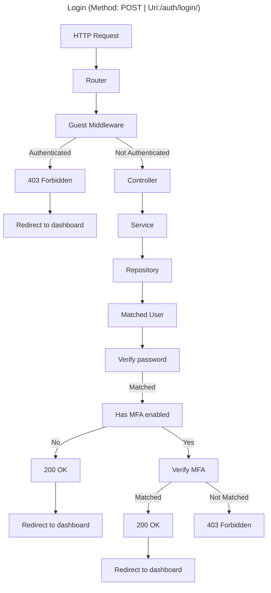
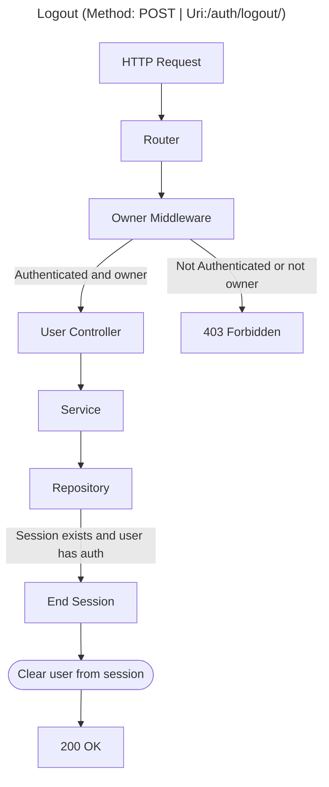
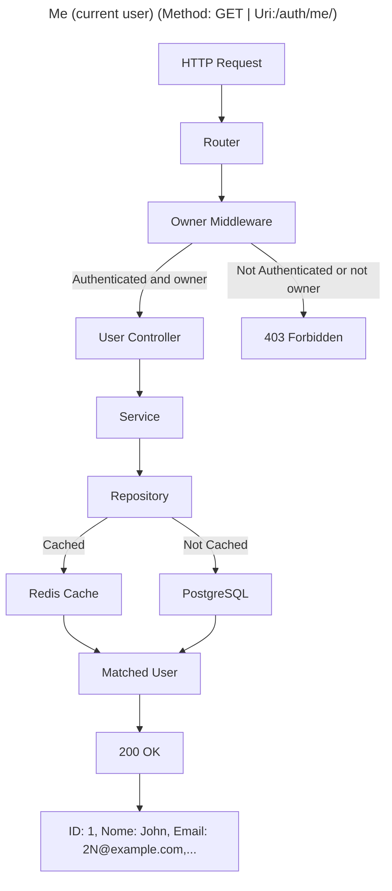
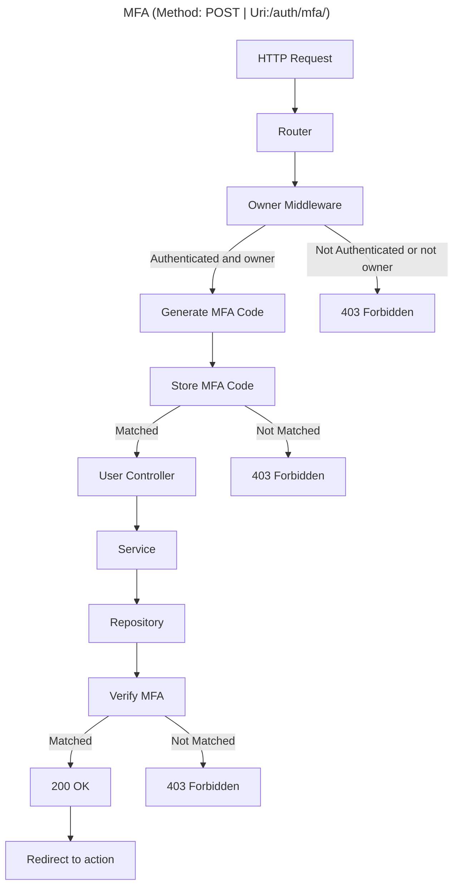
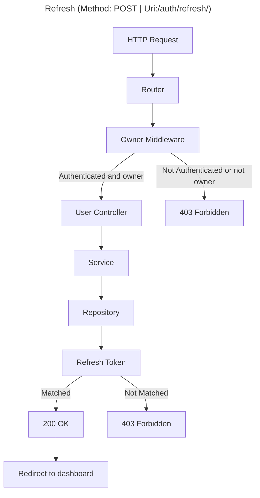

# Authentication Flow

## LOGIN

```mermaid
---
title: "Login (Method: POST | Uri:/auth/login/)"
theme: neo-dark
---
flowchart TB
    HTTP["HTTP Request"]
    HTTP --> ROUTER["Router"]
    ROUTER --> GUEST["Guest Middleware"]
    GUEST["Guest Middleware"] --> |Authenticated| UNAUTHORIZED_RESPONSE["403 Forbidden"] --> DASHBOARD_REDIRECT["Redirect to dashboard"]
    GUEST["Guest Middleware"] --> |Not Authenticated| CONTROLLER["Controller"]
    CONTROLLER --> SERVICE["Service"] --> REPOSITORY["Repository"] --> 
    LIST["Matched User"] --> PASSWORD["Verify password"] --> |Matched| HAS_MFA["Has MFA enabled"]
    HAS_MFA["Has MFA enabled"] --> |No| AUTHENTICATED_RESPONSE_NO_MFA["200 OK"] --> DASHBOARD_REDIRECT_NO_MFA["Redirect to dashboard"]
    HAS_MFA["Has MFA enabled"] --> |Yes| MFA["Verify MFA"]
    MFA["Verify MFA"]
    MFA["Verify MFA"] --> |Matched| AUTHENTICATED_RESPONSE_MFA["200 OK"] --> DASHBOARD_REDIRECT_MFA["Redirect to dashboard"]
    MFA["Verify MFA"] --> |Not Matched| UNAUTHORIZED_RESPONSE_MFA["403 Forbidden"]

```

## LOGOUT

```mermaid
---
title: "Logout (Method: POST | Uri:/auth/logout/)"
theme: neo-dark
---
flowchart TD
    HTTP["HTTP Request"]
    HTTP --> ROUTER["Router"]
    ROUTER --> AUTH["Owner Middleware"]
    AUTH --> |Authenticated and owner| CONTROLLER["User Controller"]
    AUTH --> |Not Authenticated or not owner| ERROR["403 Forbidden"]
    CONTROLLER --> SERVICE["Service"] --> REPOSITORY["Repository"] --> 
    |Session exists and user has auth| SESSION["End Session"] --> ACTIVE_SESSION(["Clear user from session"]) -->
    LOGOUT_RESPONSE["200 OK"]
```

## ME

```mermaid
---
title: "Me (current user) (Method: GET | Uri:/auth/me/)"
theme: neo-dark
---
flowchart TD
    HTTP["HTTP Request"]
    HTTP --> ROUTER["Router"]
    ROUTER --> AUTH["Owner Middleware"]
    AUTH --> |Authenticated and owner| CONTROLLER["User Controller"] --> SERVICE["Service"]
    AUTH --> |Not Authenticated or not owner| ERROR["403 Forbidden"]
    SERVICE --> REPOSITORY["Repository"] 
    REPOSITORY --> |Cached| REDIS["Redis Cache"] --> USER
    REPOSITORY --> |Not Cached| DB["PostgreSQL"] --> USER    
    USER["Matched User"] --> ME_RESPONSE["200 OK"] --> 
    USER_DATA["ID: 1, Nome: John, Email: 2N@example.com,..."]
```

## MFA

```mermaid 
--- 
title: "MFA (Method: POST | Uri:/auth/mfa/)"
theme: neo-dark
---
flowchart TD
    HTTP["HTTP Request"]
    HTTP --> ROUTER["Router"]
    ROUTER --> AUTH["Owner Middleware"]
    AUTH --> |Authenticated and owner| GENERATE_CODE["Generate MFA Code"] --> STORE_CODE["Store MFA Code"]
    AUTH --> |Not Authenticated or not owner| ERROR["403 Forbidden"]
    STORE_CODE --> |Matched| CONTROLLER["User Controller"]
    STORE_CODE --> |Not Matched| ERROR_WRONG_CODE["403 Forbidden"]
    CONTROLLER --> SERVICE["Service"] --> REPOSITORY["Repository"] --> 
    MFA["Verify MFA"] --> |Matched| AUTHENTICATED_RESPONSE_MFA["200 OK"] --> ACTION_REDIRECT_MFA["Redirect to action"]
    MFA["Verify MFA"] --> |Not Matched| UNAUTHORIZED_RESPONSE_MFA["403 Forbidden"]
```

## REFRESH

```mermaid
---
title: "Refresh (Method: POST | Uri:/auth/refresh/)"
theme: neo-dark
--- 
flowchart TD
    HTTP["HTTP Request"]
    HTTP --> ROUTER["Router"]
    ROUTER --> AUTH["Owner Middleware"]
    AUTH --> |Authenticated and owner| CONTROLLER["User Controller"]
    AUTH --> |Not Authenticated or not owner| ERROR["403 Forbidden"]
    CONTROLLER --> SERVICE["Service"] --> REPOSITORY["Repository"] --> 
    REFRESH["Refresh Token"] --> |Matched| AUTHENTICATED_RESPONSE["200 OK"] --> DASHBOARD_REDIRECT["Redirect to dashboard"]
    REFRESH["Refresh Token"] --> |Not Matched| UNAUTHORIZED_RESPONSE["403 Forbidden"]
```