# VCNexus ERP

VCNexus is a multi-tenant ERP built as a **modular monolith**: one deployed application, organized internally into clear business modules that each own their own logic and data access, sharing common infrastructure where it makes sense.

Goal: keep the codebase organized so modules can evolve independently, without turning this into a distributed system or a big ball of mud.

Status: **not started — this document is the blueprint for the initial setup.**

---

## Tech Stack

| Layer | Choice |
|---|---|
| Runtime | Docker (multi-container) |
| Backend | PHP 8.4, pure PHP — **no framework** |
| Database | PostgreSQL (with Row-Level Security for tenant isolation) |
| DB Access | ADOdb |
| Cache / Sessions / Queues | Redis |
| Frontend | Vue.js 3 |
| Styling | TailwindCSS |
| Icons | Lucide Vue + Bootstrap Icons |

No framework means no Laravel/Symfony/HyperF conventions to lean on — routing, DI, middleware pipeline, and the request lifecycle below are all things this project owns and implements itself. Keep that surface intentionally small.

---

## 1. High-Level Architecture

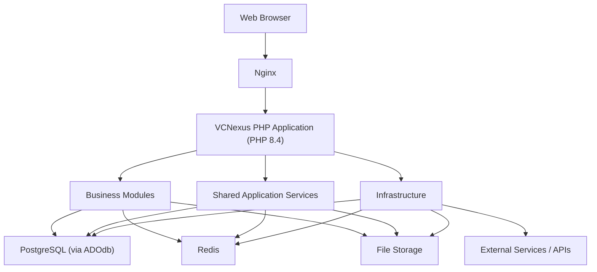

```text
Browser
   │
   ▼
Nginx
   │
   ▼
PHP 8.4 Application (pure PHP)
   │
   ├── Business Modules
   ├── Shared Services
   └── Infrastructure
        │
        ├── PostgreSQL (ADOdb)
        ├── Redis
        ├── File Storage
        └── External APIs
```

Every module ships inside the same app and the same Docker image. Nothing here requires a module to become its own service.

---

## 2. Modular Monolith

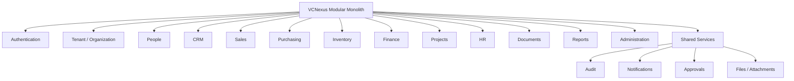

```text
src/
├── Modules/
│   ├── Authentication/
│   ├── Tenant/
│   ├── People/
│   ├── CRM/
│   ├── Sales/
│   ├── Purchasing/
│   ├── Inventory/
│   ├── Finance/
│   ├── Projects/
│   ├── HR/
│   ├── Documents/
│   ├── Reports/
│   └── Administration/
│
└── Shared/
    ├── Audit/
    ├── Notifications/
    ├── Approvals/
    ├── Files/
    └── ...
```

Folder names can change — what matters is that each business area has a real boundary.

---

## 3. Module Structure

Each module owns its own slice of the codebase instead of dumping everything into one global `Controllers` / `Models` / `Services` tree.

```text
src/
└── Modules/
    └── Sales/
        ├── Controllers/
        ├── Services/
        ├── Models/
        ├── Repositories/
        ├── Validators/
        ├── DTOs/
        └── ...
```

Since there's no framework autoloading conventions or ORM to lean on, `Repositories/` here is where all ADOdb query building lives — services should never touch ADOdb directly.

### Wait, isn't the Model supposed to do `find()` and `save()`?

If you've used Laravel (Eloquent), you're probably used to writing `User::find(1)` or `$user->save()` directly on the Model. That's a completely normal, widely-used pattern — but it's not what's happening in this project, so it's worth slowing down on *why*, especially since it's an easy thing to carry over from habit without noticing.

**Think of it like a filing cabinet, not a robot.**

- The **Model** is a single folder inside the cabinet — it just *holds information*. A `SalesOrder` Model is a piece of paper that says "id: 123, customer: 456, total: $500". That's it. It doesn't know how to get itself out of the cabinet, and it doesn't know how to file itself back in.
- The **Repository** is the person who operates the cabinet. It knows which drawer sales orders live in, how to search for one, and how to put a new one away. When you say "get me sales order 123," you ask the Repository — not the piece of paper.

```php
// The Model — just data. No idea how it got here, no idea how to save itself.
final class SalesOrder
{
    public function __construct(
        public readonly string $id,
        public readonly string $customerId,
        public readonly float $total,
    ) {}
}

// The Repository — knows the actual SQL/ADOdb calls to fetch or save that data.
final class SalesOrderRepository extends BaseRepository
{
    public function find(string $id): ?SalesOrder
    {
        $row = $this->db->GetRow("SELECT * FROM sales_orders WHERE id = ?", [$id]);
        return $row ? new SalesOrder($row['id'], $row['customer_id'], (float) $row['total']) : null;
    }

    public function store(SalesOrder $order): void
    {
        $this->db->Execute("INSERT INTO sales_orders (id, customer_id, total) VALUES (?, ?, ?)",
            [$order->id, $order->customerId, $order->total]);
    }
}
```

If `SalesOrder` had `find()` and `save()` on itself instead, the piece of paper would suddenly need to know SQL, know about the database connection, and know which tenant it belongs to. That's a lot for something that's supposed to just be "id, customer, total."

### Okay, but why does that actually matter? Isn't it more files either way?

It is more files — that part's true, there's no getting around it. Here's what you get for that extra file, using things already true about this specific project:

1. **Your `Models/` folder gets regenerated by the schema compiler.** Every time you change a `.schema.yml` file and recompile, `Models/SalesOrder.php` gets rewritten from scratch. If `find()`/`save()` lived there, you'd lose your hand-written database logic every time you touched a schema. Keeping that logic in a separate `Repository` file means the compiler never touches it — it's safe.
2. **Every table in this ERP belongs to a tenant**, and the correct tenant has to be part of every single query (that's the whole Row-Level-Security setup from § 7). A Repository is built fresh for each request already knowing "which tenant am I working for right now" — a Model has no natural place to hold that.
3. **Testing gets way easier.** If `SalesOrderService` needs a `SalesOrderRepository` handed to it (instead of calling `SalesOrder::find()` directly), you can test the Service by handing it a *fake* Repository that just returns made-up data — no real database needed at all for that test.
4. **Multi-step operations become manageable.** Creating a sales order touches Sales, Inventory, and Finance in one transaction (§ 6). That only works cleanly if "how to write to the database" is something you can pass around and coordinate (`$this->salesRepo`, `$this->inventoryRepo`) — not something baked invisibly into three different Models across three different modules.

None of this means Eloquent's approach is "wrong" — it's a completely reasonable tradeoff for smaller apps, and it's popular for a good reason: it's less typing. It just stops paying off once you have 13 modules, generated Models, and tenant-scoped everything, which is exactly the situation here.

**The rule of thumb, going forward:** if a method needs to talk to the database (`$this->db`, SQL, `find`, `save`, `update`), it goes in the **Repository**. If a method only works with information the object already has (like checking `$order->status === 'pending'`), it's fine to put it on the **Model** itself.

---

## 4. Recommended Project Structure

```text
schemas/                        # Source of truth for table definitions — read by the compiler
├── Authentication/
│   ├── users.schema.yml
│   └── roles.schema.yml
├── People/
│   ├── customers.schema.yml
│   └── suppliers.schema.yml
├── Sales/
│   ├── quotes.schema.yml
│   ├── sales_orders.schema.yml
│   └── invoices.schema.yml
├── Inventory/
│   └── products.schema.yml
└── ...                        # one folder per module, mirroring src/Modules/

tools/
└── schema-compiler/           # Reads schemas/ → generates migrations + models/DTOs
    ├── Compiler.php
    ├── Generators/
    │   ├── MigrationGenerator.php
    │   ├── ModelGenerator.php
    │   └── DTOGenerator.php
    └── bin/compile.php        # Entry point: run this after editing a schema

database/
└── migrations/                # Generated SQL, single global timeline (see note below)

src/
│
├── Modules/
│   │
│   ├── Authentication/
│   ├── Tenant/
│   ├── People/
│   ├── CRM/
│   ├── Sales/
│   │   ├── Controllers/
│   │   │   ├── QuoteController.php        # one controller per resource, not per module
│   │   │   ├── SalesOrderController.php
│   │   │   └── InvoiceController.php
│   │   ├── Services/
│   │   ├── Models/                        # generated from schemas/Sales/*.schema.yml
│   │   ├── Repositories/
│   │   ├── Validators/
│   │   └── DTOs/
│   ├── Purchasing/
│   ├── Inventory/
│   ├── Finance/
│   ├── Projects/
│   ├── HR/
│   ├── Documents/
│   ├── Reports/
│   └── Administration/
│
├── Shared/
│   ├── Audit/
│   ├── Notifications/
│   ├── Approvals/
│   ├── Files/
│   ├── Events/
│   ├── Schema/
│   │   ├── Attributes/          # Structural attributes used across every module's Models
│   │   │   ├── Column.php        # #[Column('email', type: 'varchar', length: 255)]
│   │   │   ├── PrimaryKey.php     # #[PrimaryKey]
│   │   │   ├── ForeignKey.php     # #[ForeignKey(references: Customer::class, column: 'id')]
│   │   │   ├── Index.php          # #[Index(['tenant_id', 'status'])]
│   │   │   ├── Unique.php
│   │   │   ├── Nullable.php
│   │   │   ├── Timestamps.php     # #[Timestamps] → created_at/updated_at (+ optional deleted_at)
│   │   │   ├── Auditable.php       # #[Auditable] → created_by/updated_by — kept separate, see note
│   │   │   └── TenantScoped.php   # cross-cutting business rule, not just structural — see note
│   │   └── Compiler/             # Reads schemas/*.schema.yml + these attributes → generates SQL + Models
│   │       ├── AttributeReader.php  # getTimestamps(), getAuditable() — class-level attributes
│   │       └── ColumnResolver.php    # resolveFromColumnAttributes(), resolveColumns() — property-level + merged
│   │   └── BaseModel.php          # tenant_id handling, toArray(), timestamp casting — used by generated Models
│   ├── Http/
│   │   ├── Request.php            # Wraps $_GET/$_POST/php://input — passed through the middleware pipeline
│   │   ├── Response.php            # Wraps the outgoing response — controllers return this, never echo directly
│   │   ├── MiddlewareInterface.php # handle(Request): ?Response — contract every middleware implements
│   │   ├── Attributes/           # Request-lifecycle attributes used across every module's Controllers
│   │   │   ├── Middleware.php     # #[Middleware(AuthMiddleware::class)]
│   │   │   ├── RateLimit.php       # #[RateLimit(perMinute: 60)]
│   │   │   ├── RequiresPermission.php # #[RequiresPermission('sales.orders.approve')]
│   │   │   └── Cache.php           # #[Cache(ttl: 300)] — if route responses get cached
│   │   ├── Middleware/            # The actual middleware classes — each implements MiddlewareInterface
│   │   │   ├── AuthMiddleware.php
│   │   │   ├── TenantResolverMiddleware.php
│   │   │   ├── RateLimitMiddleware.php
│   │   │   ├── PermissionMiddleware.php
│   │   │   └── AuditLogMiddleware.php
│   │   └── Controllers/
│   │       └── BaseController.php  # json()/error() response helpers, currentTenantId(), currentUser()
│   ├── Domain/
│   │   ├── DataTransferObjectInterface.php # toArray() contract — Models & DTOs implement this
│   │   ├── BaseService.php         # transactional() — wraps StartTrans/CompleteTrans/FailTrans
│   │   └── BaseRepository.php       # generic store()/update() built on DataTransferObjectInterface
│   ├── Authorization/                # RBAC — see § 6.3, never columns/JSON on the users table
│   │   ├── Models/
│   │   │   ├── Role.php
│   │   │   └── Permission.php
│   │   ├── Repositories/
│   │   │   └── PermissionRepository.php  # resolves user → roles → permissions
│   │   └── PermissionCache.php             # Redis-backed, invalidated on role/permission change
│   ├── Container/                     # See § 6.5 — resolves Controllers/Repositories via Reflection
│   │   ├── Container.php
│   │   └── ContainerException.php
│   └── ...
│
├── Infrastructure/
│   ├── Database/                     # See § 6.4 for the full breakdown
│   │   ├── ConnectionFactory.php       # Builds the raw ADOdb connection (host/creds from secrets/)
│   │   ├── TenantContext.php            # Applies SET app.tenant_id via set_config() — § 7's mechanism
│   │   └── ConnectionProvider.php        # get($tenantId) for scoped queries, getUnscoped() for pre-tenant lookups (§ 7.0.1)
│   ├── Redis/
│   │   └── RedisConnectionFactory.php    # Same idea, simpler — no tenant-context equivalent needed
│   ├── Mail/
│   ├── Storage/
│   └── Integrations/
│
└── Bootstrap/
    ├── Configuration/
    ├── Routing/
    │   ├── Router.php              # Matches URL → Controller + method
    │   ├── RouteAttributeReader.php # Reflects controller methods for routing + middleware + rate-limit attrs
    │   └── MiddlewarePipeline.php   # Reads #[Middleware] attrs, runs them in order before dispatch
    ├── Application.php          # Builds DI/config/router, dispatches HTTP requests
    └── WebSocketApplication.php # Boots Ratchet, wires it to Shared/ services — see § 11.1

src/Realtime/                # Ratchet WebSocket layer — own concern, same level as Bootstrap
├── Server.php                 # Ratchet\App setup, port binding
├── Connections/
│   └── ConnectionManager.php   # tracks connected clients, tenant/user mapping
└── Handlers/
    ├── NotificationHandler.php
    └── SalesOrderHandler.php    # e.g. broadcasts order-status changes

public/
└── index.php            # Web-reachable HTTP entry point — thin: loads autoloader, boots Application.php

bin/
└── websocket-server.php  # CLI entry point — thin: loads autoloader, boots WebSocketApplication.php

frontend/
├── index.html                # Vite's real entry — <script src="/src/main.js">
├── src/
│   ├── main.js                # creates the Vue app, installs router/pinia/i18n, mounts #app
│   ├── App.vue                 # root component — router-view + global layout shell
│   ├── assets/                    # Vite-processed static files: images, fonts, static icons
│   │   ├── images/
│   │   └── fonts/
│   ├── styles/
│   │   └── app.css                # @tailwind base/components/utilities + global overrides
│   ├── i18n/
│   │   ├── index.js                # vue-i18n instance, locale loader/merger, fallback locale
│   │   ├── locales/
│   │   │   └── shared/              # cross-cutting strings: buttons, errors, validation
│   │   │       ├── en-US.json
│   │   │       └── pt-BR.json
│   │   └── modules/                 # mirrors src/Modules/ and views/ below, one per domain
│   │       ├── dashboard/
│   │       │   ├── en-US.json
│   │       │   └── pt-BR.json
│   │       ├── people/
│   │       │   ├── en-US.json
│   │       │   └── pt-BR.json
│   │       ├── sales/
│   │       │   ├── en-US.json
│   │       │   └── pt-BR.json
│   │       └── ...
│   ├── components/
│   ├── layouts/
│   ├── router/
│   ├── stores/                     # Pinia — shared, app-wide state (current user, tenant)
│   ├── services/                    # Module-specific API calls — endpoints, domain shape
│   │   ├── sales/
│   │   │   ├── salesOrderService.js
│   │   │   ├── quoteService.js
│   │   │   └── invoiceService.js
│   │   ├── inventory/
│   │   │   └── productService.js
│   │   ├── people/
│   │   │   ├── customerService.js
│   │   │   └── supplierService.js
│   │   └── ...                        # one folder per module, mirrors src/Modules/
│   ├── composables/                  # Generic, reusable *behavior* — no domain knowledge — see below
│   │   ├── usePagination.js
│   │   ├── useApiRequest.js           # generic HTTP wrapper: loading/error state, auth+tenant headers
│   │   ├── useFormValidation.js
│   │   ├── useConfirmDialog.js
│   │   ├── usePermissions.js          # "can this user do X" checks, reused across modules
│   │   └── useDebouncedSearch.js
│   ├── utils/
│   └── views/
│       ├── dashboard/
│       ├── organization/
│       ├── people/
│       ├── crm/
│       ├── sales/
│       ├── purchasing/
│       ├── inventory/
│       ├── finance/
│       ├── projects/
│       ├── hr/
│       ├── documents/
│       ├── reports/
│       └── administration/
│
├── tailwind.config.js    # frontend/ root, not inside src/ — Vite/Tailwind convention
├── postcss.config.js
└── vite.config.js

docker/
├── nginx/
├── php/
├── postgres/
├── pgdog/                   # Connection pooler config (optional — see § 7.1) — sibling to postgres/
└── redis/

secrets/                   # Top-level, sibling to src/frontend/docker — NEVER committed, split by concern
├── database/
│   ├── db_password.txt
│   └── db_replica_password.txt      # if a read replica is ever added
├── redis/
│   └── redis_password.txt
├── smtp/
│   ├── smtp_user.txt
│   └── smtp_password.txt
├── messaging/                        # message queue / broker creds, if added later
│   └── broker_password.txt
├── jwt/
│   ├── signing_key.pem
│   └── public_key.pem
├── fiscal/                            # SEFAZ/NF-e certs — highest-stakes secret, isolated on its own
│   ├── certificate.pfx
│   └── certificate_password.txt
├── .env                                # App-level, non-per-service vars (APP_KEY, APP_ENV, etc.)
└── .env.example                         # ← the ONLY file in here that IS committed, mirrors this tree

storage/                     # Runtime-populated — empty on clone, kept via .gitkeep (see note below)
├── app/
│   └── .gitkeep
└── logs/
    └── .gitkeep

docker-compose.yml
.gitignore
.dockerignore
```

**Schemas are source of truth, not runtime code.** `schemas/` mirrors `src/Modules/` one-to-one, but lives outside `src/` because it's an *input* to the compiler, not application logic. The compiler in `tools/schema-compiler/` reads a `.schema.yml` and generates the module's migration and its `Models/`/`DTOs/` — you edit the schema, re-run the compiler, and the generated files update. Never hand-edit generated `Models/` directly; hand-edit the schema and recompile, or the next compile run silently overwrites your change.

**Column/foreign-key/index attributes live in `Shared/Schema/Attributes/`, never per-module.** `#[Column]`, `#[ForeignKey]`, `#[PrimaryKey]`, `#[Index]` describe how a column is *stored* — that's identical regardless of which module the table belongs to, so defining them once in Shared and reusing them everywhere avoids N duplicate copies of the same primitive. This also matters because cross-module foreign keys are the norm in an ERP (`SalesOrder` referencing `Customer` from People, `PurchaseOrder` referencing `Product` from Inventory) — a neutral, shared `ForeignKey` attribute has no awkward dependency on either module, whereas defining it inside `Modules/Sales/` would force `Modules/Purchasing/` to import something that isn't actually Sales-specific. The test: **does the attribute describe storage shape, or a business rule?** Storage shape (`Column`, `ForeignKey`, `Index`, `Unique`, `Timestamps`) → `Shared/Schema/Attributes/`. A genuine business rule (e.g. `#[RequiresApproval]`) stays with the module it belongs to — the one exception is something so cross-cutting every tenant table needs it, like `#[TenantScoped]`, which earns a place in Shared even though it carries business meaning rather than pure structure.

### `#[Timestamps]` and `#[Auditable]` — same intent, kept as two separate attributes

They show up on the same tables and feel like one concern, but they need different inputs to resolve, which is reason enough to keep them apart: `created_at`/`updated_at` only need `now()`, while `created_by`/`updated_by` need "who is making this request" — the current authenticated user's ID, sourced from the `Request`, not something the attribute or Repository can know on its own. Merging them into one attribute would make every `store()`/`update()` call silently depend on a user ID being available, which breaks for system-generated writes (a scheduled job, a migration script, a webhook) that have no user at all.

```php
<?php
// Shared/Schema/Attributes/Timestamps.php
namespace VCNexus\Shared\Schema\Attributes;

use Attribute;

#[Attribute(Attribute::TARGET_CLASS)]
final class Timestamps
{
    public function __construct(
        public readonly string $createdAtColumn = 'created_at',
        public readonly string $updatedAtColumn = 'updated_at',
        public readonly bool $trackDeletedAt = false,   // opt into soft-deletes if needed
    ) {}
}
```

```php
<?php
// Shared/Schema/Attributes/Auditable.php
namespace VCNexus\Shared\Schema\Attributes;

use Attribute;

#[Attribute(Attribute::TARGET_CLASS)]
final class Auditable
{
    public function __construct(
        public readonly string $createdByColumn = 'created_by',
        public readonly string $updatedByColumn = 'updated_by',
    ) {}
}
```

Both stack on the same Model, since a table can reasonably want one without the other — a `login_attempts` log might want `created_at` with no meaningful "who created this" at all:

```php
#[Timestamps]
#[Auditable]
class SalesOrder extends BaseModel implements DataTransferObjectInterface
{
    #[PrimaryKey]
    #[Column('id', type: 'uuid')]
    public string $id;

    #[Column('customer_id', type: 'uuid')]
    #[ForeignKey(references: Customer::class, column: 'id')]
    public string $customerId;
}
```

### `ColumnResolver` — reading `#[Column]` off every property, not just the class

`AttributeReader::getTimestamps()` reads one class-level attribute. `ColumnResolver::resolveFromColumnAttributes()` is the counterpart that walks every **property** on the Model, reading `#[Column]` plus whatever else (`#[PrimaryKey]`, `#[ForeignKey]`, `#[Nullable]`, `#[Unique]`) sits on that same property:

```php
<?php
// Shared/Schema/Compiler/ColumnResolver.php
namespace VCNexus\Shared\Schema\Compiler;

use VCNexus\Shared\Schema\Attributes\{Column, PrimaryKey, ForeignKey, Nullable, Unique, Timestamps, Auditable};

final class ColumnResolver
{
    public function __construct(private AttributeReader $attributeReader) {}

    /** @return ColumnDefinition[] */
    public function resolveFromColumnAttributes(string $modelClass): array
    {
        $reflection = new \ReflectionClass($modelClass);
        $columns = [];

        foreach ($reflection->getProperties() as $property) {
            $columnAttrs = $property->getAttributes(Column::class);
            if (empty($columnAttrs)) {
                continue; // property isn't a DB column — skip it
            }

            /** @var Column $column */
            $column = $columnAttrs[0]->newInstance();

            $columns[] = new ColumnDefinition(
                name: $column->name,
                type: $column->type,
                length: $column->length ?? null,
                precision: $column->precision ?? null,
                scale: $column->scale ?? null,
                isPrimaryKey: $this->hasAttribute($property, PrimaryKey::class),
                isNullable: $this->hasAttribute($property, Nullable::class),
                isUnique: $this->hasAttribute($property, Unique::class),
                foreignKey: $this->resolveForeignKey($property),
            );
        }

        return $columns;
    }

    /** @return ColumnDefinition[] — full column set: real properties + Timestamps + Auditable columns */
    public function resolveColumns(string $modelClass): array
    {
        $columns = $this->resolveFromColumnAttributes($modelClass);

        if ($timestamps = $this->attributeReader->getTimestamps($modelClass)) {
            $columns[] = new ColumnDefinition($timestamps->createdAtColumn, type: 'timestamptz', nullable: false, default: 'now()');
            $columns[] = new ColumnDefinition($timestamps->updatedAtColumn, type: 'timestamptz', nullable: false, default: 'now()');

            if ($timestamps->trackDeletedAt) {
                $columns[] = new ColumnDefinition('deleted_at', type: 'timestamptz', nullable: true);
            }
        }

        if ($auditable = $this->attributeReader->getAuditable($modelClass)) {
            $columns[] = new ColumnDefinition($auditable->createdByColumn, type: 'uuid', nullable: true);
            $columns[] = new ColumnDefinition($auditable->updatedByColumn, type: 'uuid', nullable: true);
        }

        return $columns;
    }

    private function hasAttribute(\ReflectionProperty $property, string $attributeClass): bool
    {
        return !empty($property->getAttributes($attributeClass));
    }

    private function resolveForeignKey(\ReflectionProperty $property): ?ForeignKeyDefinition
    {
        $attrs = $property->getAttributes(ForeignKey::class);
        if (empty($attrs)) {
            return null;
        }

        /** @var ForeignKey $fk */
        $fk = $attrs[0]->newInstance();
        return new ForeignKeyDefinition(referencesClass: $fk->references, referencesColumn: $fk->column);
    }
}
```

`ColumnDefinition`/`ForeignKeyDefinition` here are plain value objects the compiler builds *from* reading the attributes — not the same thing as the attribute classes themselves. The attribute is the annotation written on the Model; the Definition is what the compiler resolves it into, ready to hand to whatever generates the actual `CREATE TABLE`/`ALTER TABLE` SQL.

### `created_by`/`updated_by` at write time — nullable `$currentUserId`, not a global

`BaseRepository` needs the current user's ID to populate `#[Auditable]` columns, threaded in explicitly (same reasoning as § 6.1's Request/Response — no global state):

```php
// Shared/Domain/BaseRepository.php
abstract class BaseRepository
{
    public function __construct(
        protected \ADOConnection $db,
        protected string $tenantId,
        protected ?string $currentUserId = null,   // null = system-generated write (job, migration, webhook)
    ) {}

    public function store(DataTransferObjectInterface $data): void
    {
        $row = array_merge($data->toArray(), ['tenant_id' => $this->tenantId]);

        if ($timestamps = $this->attributeReader->getTimestamps(static::class)) {
            $row[$timestamps->createdAtColumn] = date('Y-m-d H:i:s');
        }
        if (($auditable = $this->attributeReader->getAuditable(static::class)) && $this->currentUserId) {
            $row[$auditable->createdByColumn] = $this->currentUserId;
        }

        // ...INSERT using $row
    }
}
```

`$currentUserId` defaulting to `null` makes "no user" a first-class case rather than something that crashes or requires a fake system-user row. It's sourced the same way `tenant_id` already is (§ 7): `AuthMiddleware` sets the authenticated user's ID on the `Request`, and whatever constructs each Repository per-request reads `$request->attribute('user_id')` and passes it into the constructor alongside `tenantId`.

**Where they live:**

```text
Shared/Schema/Attributes/
├── Timestamps.php
└── Auditable.php

Shared/Schema/Compiler/
├── AttributeReader.php      # getTimestamps(), getAuditable() — class-level attributes
└── ColumnResolver.php        # resolveFromColumnAttributes(), resolveColumns() — property-level + merged
```

**Middleware and rate-limit attributes are a different concern — `Shared/Http/`, not `Shared/Schema/`.** `#[Middleware]`, `#[RateLimit]`, `#[RequiresPermission]` describe *request-lifecycle* behavior, not storage, so they get their own subfolder under Shared rather than living next to the schema attributes. Same reasoning as before applies to *why* they're shared: `#[RateLimit(perMinute: 10)]` doesn't know or care whether it's decorating a Sales endpoint or an HR endpoint — one class, reused on any controller method.

A distinction worth keeping straight: **where the attribute class is defined** vs. **where it actually executes** are two different questions. `#[Middleware(AuthMiddleware::class)]` is declared on a controller method in `Modules/Sales/Controllers/`, but nothing runs it there — the middleware *classes* live in `Shared/Http/Middleware/`, and the code that reflects each controller method for `#[Middleware]`/`#[RateLimit]`/`#[RequiresPermission]` attributes and actually executes them, in order, before the controller runs, lives in `Bootstrap/Routing/MiddlewarePipeline.php`. That pipeline sits in `Bootstrap/` (not `Shared/`) because it's part of the request dispatch mechanism itself, tightly coupled to the router — not a piece of reusable business infrastructure the way audit logging or notifications are.

Updated request flow with the pipeline made explicit:

```text
Nginx → public/index.php → Bootstrap/Application.php
    → Bootstrap/Routing/Router.php            (matches route)
    → Bootstrap/Routing/MiddlewarePipeline.php  (reads #[Middleware] attrs, runs each in order)
         AuthMiddleware → TenantResolverMiddleware → RateLimitMiddleware → PermissionMiddleware
    → Modules/Sales/Controllers/SalesOrderController::approve()
```

**`Request`/`Response` wrap PHP's raw HTTP primitives — without them the middleware pipeline has nowhere to attach data.** With no framework, there's nothing wrapping `$_GET`/`$_POST`/`php://input`/`header()`/`echo` by default. `Shared/Http/Request.php` is built once from globals in `Bootstrap/Application.php` and passed through the whole pipeline — each middleware reads from and can attach data to it (`TenantResolverMiddleware` sets `tenant_id`, which `BaseController::currentTenantId()` later reads back off the same object). `Shared/Http/Response.php` is the mirror: controllers construct and return a `Response`, and only `Bootstrap/Application.php` ever calls `->send()` to actually emit headers and echo the body — controllers never touch `echo` or `header()` directly. This also makes controllers testable without faking superglobals: a test just constructs a `Request` and asserts on the returned `Response`.

**Base classes (`BaseController`, `BaseService`, `BaseModel`, `BaseRepository`) are worth having, but only where they hold real shared behavior — not as empty marker classes.** The test: does every module's Controller/Service/Model genuinely repeat the same mechanism? If yes, it earns a base class in `Shared/`; if not, skip it — an empty `abstract class BaseController {}` implies shared behavior that doesn't exist and invites someone to bolt on a method later that only half the controllers actually want.

| Base class | Lives in | Holds |
|---|---|---|
| `BaseController` | `Shared/Http/Controllers/` | `json()`/`error()` response helpers, `currentTenantId()`/`currentUser()` reading off the `Request` |
| `BaseService` | `Shared/Domain/` | `transactional()` — wraps `StartTrans()`/`CompleteTrans()`/`FailTrans()` so services don't repeat it by hand |
| `BaseRepository` | `Shared/Domain/` | ADOdb connection handling, tenant-scoped `find()`/`findAll()`/`save()` |
| `BaseModel` | `Shared/Schema/` | `tenant_id` handling, `toArray()`, timestamp casting — used by every compiler-generated Model so the compiler doesn't re-emit this boilerplate per module |

```php
// Shared/Http/Controllers/BaseController.php
abstract class BaseController
{
    protected function json(array $data, int $status = 200): Response { return Response::json($data, $status); }
    protected function error(string $message, int $status = 422): Response { return $this->json(['error' => $message], $status); }
}

// Shared/Domain/BaseService.php
abstract class BaseService
{
    public function __construct(protected \ADOConnection $db) {}
    protected function transactional(callable $operation): mixed
    {
        $this->db->StartTrans();
        $result = $operation();
        $this->db->CompleteTrans(); // rolls back automatically if FailTrans() was called inside
        return $result;
    }
}
```

**Migrations sit in one global timeline** (`database/migrations/`) rather than per-module, even though schemas are per-module. Foreign keys cross module boundaries constantly (Sales → Inventory → Finance), so migrations need one deterministic apply order across the whole database — a per-module migration folder can't express "Sales' `sales_orders` table depends on Inventory's `products` table already existing."

**One controller per resource, not one per module.** `Sales/Controllers/` has `QuoteController`, `SalesOrderController`, and `InvoiceController` — three separate REST resources with independent HTTP verbs, validation, and state transitions — rather than a single `SalesController` handling all three. A single fat controller per module just recreates the "God object" problem inside a folder instead of a class. Cross-resource coordination (e.g. a sales order triggering inventory + finance updates) belongs in the service layer, not in the controllers talking to each other.

**`public/index.php` vs. `Bootstrap/Application.php`.** These do different jobs and both exist. `public/index.php` is the only file the webserver is allowed to execute — it stays deliberately thin: load the Composer autoloader, instantiate `Application`, call `run()`. All the real bootstrap logic (DI container, config loading, router registration, middleware, dispatch) lives in `Bootstrap/Application.php`, outside the web-reachable `public/` directory. This is the same split frameworks like Laravel use under the hood (`public/index.php` → `bootstrap/app.php`) — here it's just explicit because there's no framework hiding it.

**i18n lives under `frontend/src/i18n/`, split by domain, one file per locale.** `i18n/modules/<domain>/` mirrors `views/<domain>/` and `src/Modules/<domain>/` on the backend, and each domain folder holds one JSON file per locale (`en-US.json`, `pt-BR.json`) rather than one file per domain — this way adding a new language later means adding files, not editing every existing domain file. `i18n/locales/shared/` holds cross-cutting strings (buttons, validation, generic errors) used across modules. `i18n/index.js` should lazy-merge a module's locale file in via `mergeLocaleMessage` as that module's view loads, rather than bundling all 13 modules' translations into the initial page load. Use full locale tags (`pt-BR`, not `pt`) from the start — the Brazilian fiscal module will eventually need locale-specific formatting, and retrofitting the tag format later touches every file.

**Assets vs. styles are kept separate.** `assets/` is for Vite-processed static files (images, fonts) — things bundled as-is. `styles/app.css` is where Tailwind's directives and any global CSS overrides live — it's config-adjacent, not a static file, so it gets its own folder rather than sitting in `assets/`. `tailwind.config.js`, `postcss.config.js`, and `vite.config.js` stay at the `frontend/` root rather than inside `src/` — that's a hard Vite/Tailwind convention (build tooling reads them before any app code runs), not a stylistic preference, so don't move them for the sake of matching the `src/` tree.

**`App.vue` and `main.js` live in `frontend/src/`, not in `frontend/` directly.** This is a Vite convention, not a choice: `frontend/` is the project root (configs, `package.json`, `index.html`), while `src/` is exclusively app source code that Vite bundles. `index.html` at the `frontend/` root has `<script type="module" src="/src/main.js">`, pointing into `src/` — so the split is structural. `main.js` creates the Vue app instance and installs the router, Pinia, and i18n; `App.vue` is the root component (typically just a layout shell wrapping `<router-view>`).

**`composables/` holds reusable *behavior*, not reusable *state*.** A composable is a function (conventionally `useSomething()`) that uses Vue's reactivity (`ref`, `computed`, `watch`) internally and returns reactive state plus functions — but unlike a Pinia store, every component that calls it gets its own independent instance. Use a composable when the same *logic* is needed in multiple places but each usage shouldn't share the same data — pagination, form validation, a debounced search input, a confirm-dialog pattern, an API-request wrapper. Use a Pinia store instead when the state itself must be one shared instance app-wide (the logged-in user, the current tenant). The test for whether something belongs in `composables/`: would a second, unrelated module want this exact same logic? If yes, it's a composable; if it's specific to how one module's view behaves, keep it inside that module's `views/` folder or a component instead.

| | Lives in | Shared across components? | Use for |
|---|---|---|---|
| Component | `.vue` file | No | Markup + logic specific to one screen |
| Composable | `composables/` | No — each caller gets a fresh instance | Reusable behavior: pagination, validation, debounced search, API wrappers |
| Pinia store | `stores/` | Yes — one shared instance app-wide | Actual shared app state: current user, current tenant |

**`services/` vs. `composables/useApiRequest.js` — API calls are split into two layers.** `useApiRequest.js` is generic HTTP plumbing: it knows nothing about Sales, Invoices, or any domain shape — just loading/error state, and attaching auth + tenant headers to every request in one place via an axios interceptor. Each module's `services/<module>/` file is where the module actually lives on the frontend: the endpoints, the domain-specific actions (`approve()`, not just generic CRUD), calling `useApiRequest()` underneath rather than touching axios directly.

```js
// composables/useApiRequest.js — generic, no domain knowledge
export function useApiRequest() {
  const loading = ref(false)
  const error = ref(null)
  async function request(config) { /* loading/error handling, calls axios */ }
  return { loading, error, request }
}

// services/sales/salesOrderService.js — module-specific
export function useSalesOrderService() {
  const { loading, error, request } = useApiRequest()
  function list(params)  { return request({ method: 'GET', url: '/sales-orders', params }) }
  function approve(id)   { return request({ method: 'POST', url: `/sales-orders/${id}/approve` }) }
  return { loading, error, list, approve }
}
```

A component calls `useSalesOrderService()`, never axios or `useApiRequest` directly. If you ever swap axios for `fetch`, or change how tenant headers are sent, one file changes instead of thirteen modules' worth of services.

**Secrets get their own top-level `secrets/` folder — not inside `docker/` — organized into subfolders by concern.** `docker/` holds Dockerfiles and service configs (things meant to be built into images or committed); `secrets/` holds actual secret *values* (DB passwords, JWT keys, SMTP creds, fiscal certs) and is never committed. Splitting `secrets/` by concern (`database/`, `smtp/`, `messaging/`, `jwt/`, `fiscal/`) rather than keeping it flat pays off two ways once you're past a handful of secrets: it lets Compose mount only what a given service actually needs (least privilege — the mailer container never sees `database/db_password.txt`), and it makes rotating one category of credential a matter of touching one folder instead of hunting a flat list of files. `fiscal/` gets its own folder specifically because NF-e/SEFAZ digital certificates are the highest-stakes secret in the project — a leaked signing cert is a legal/compliance problem, not just an infra one.

```yaml
secrets:
  db_password:
    file: ./secrets/database/db_password.txt
  smtp_password:
    file: ./secrets/smtp/smtp_password.txt
  fiscal_cert_password:
    file: ./secrets/fiscal/certificate_password.txt

services:
  app:
    secrets: [db_password]          # app only gets what it needs
  mailer:
    secrets: [smtp_password]        # mailer never sees db_password
```

The one committed exception is `secrets/.env.example` — a template with variable names but no real values, mirroring the full subfolder structure so any dev cloning the repo knows exactly what to fill in and where.

**Both `.gitignore` and `.dockerignore` need the secrets rule — they block different leaks.** The wildcard already covers every subfolder, so no per-folder ignore rules are needed. `.gitignore` stops secrets from being committed to version control:

```gitignore
/secrets/*
!/secrets/.env.example
.env
.env.local
```

`.dockerignore` stops secrets from being copied into a Docker build context/image layer — a separate leak vector from git, since an image can leak secrets even with clean git history the moment a Dockerfile has `COPY . .`:

```dockerignore
secrets/
.env
.env.local
.git
```

**Empty directories that must exist on clone need a `.gitkeep` placeholder — Git tracks files, not folders.** `storage/app/` and `storage/logs/` are populated only at runtime (uploads, logs), so on a fresh clone they wouldn't exist at all unless something inside them is committed. `.gitkeep` is a convention, not a Git feature — any filename works, `.gitkeep` is just the recognized signal for "this file's only purpose is keeping the directory." Paired with the `.gitignore` pattern already covering `storage/`:

```gitignore
/storage/app/*
!/storage/app/.gitkeep
/storage/logs/*
!/storage/logs/.gitkeep
```

This ignores everything in those folders except the placeholder, so runtime content never gets committed but the folder still exists after `git clone`. Note `secrets/` doesn't need a separate `.gitkeep` — `.env.example` already serves that role, since it's the one file explicitly un-ignored. Don't reach for `.gitkeep` on ordinary not-yet-built module folders (e.g. an empty `src/Modules/Reports/` before Reports is implemented) — that's just noise; it's only for folders meant to stay structurally empty in the repo and get populated by the running application.

---

## 5. How the Layers Work

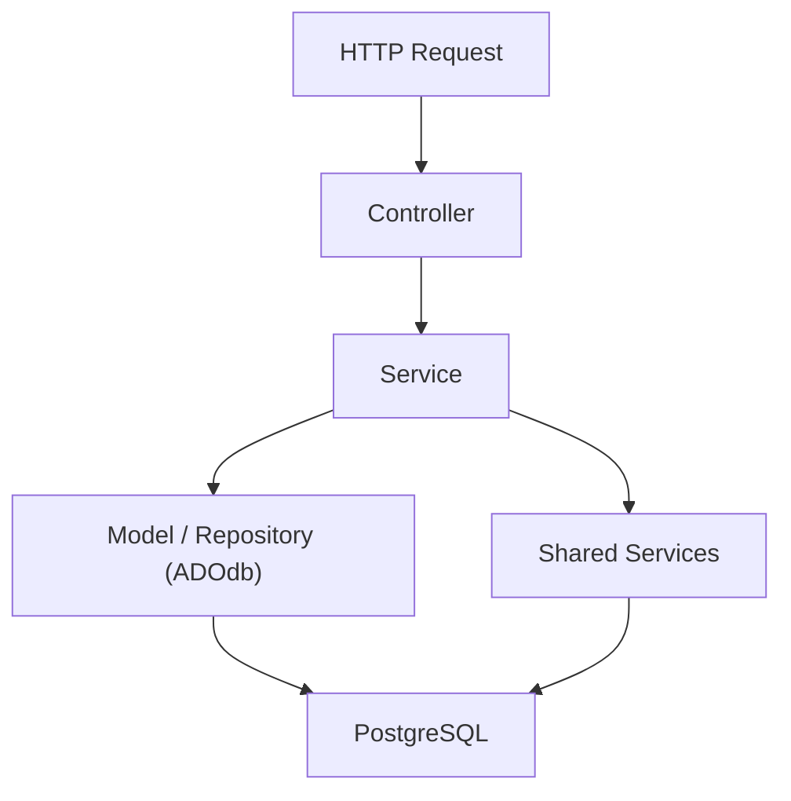

```text
HTTP Request
     │
     ▼
Controller
     │
     ▼
Sales Service
     │
     ├── Validate data
     ├── Apply business rules
     ├── Call Sales Repository (ADOdb)
     ├── Call Inventory when necessary
     └── Call Finance when necessary
     │
     ▼
PostgreSQL
```

The controller stays thin: parse the request, call the service, shape the JSON response. Business rules and cross-module coordination live in the service.

---

## 6. Transactions

Since there's no ORM/unit-of-work to manage this automatically, transaction boundaries are explicit ADOdb calls owned by the service coordinating the business operation — never by the controller, never by a repository in isolation.

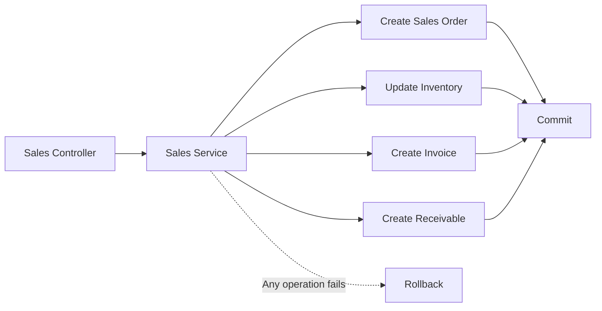

```text
SalesService
    │
    ├── $db->StartTrans()
    │
    ├── Create order
    ├── Update inventory
    ├── Create invoice
    ├── Create receivable
    │
    ├── Success → $db->CompleteTrans()
    │
    └── Failure → $db->FailTrans() → CompleteTrans() rolls back
```

(ADOdb's `StartTrans()` / `CompleteTrans()` / `FailTrans()` pattern maps directly onto this — no manual `BEGIN`/`COMMIT`/`ROLLBACK` string SQL needed.)

---

## 6.1 Typed Objects Over Arrays (Past the Validation Boundary)

Without a framework, PHP's default currency for passing data around is the associative array — and arrays have a specific failure mode that compounds across 13 modules: nothing tells you what keys exist until runtime. `$order['toatl']` (typo) is silently `null`, not an error. The convention for this project: **once data has been validated at the edge, it becomes a typed object and stays one for the rest of its life in the codebase.** Arrays are for untyped input and a small set of legitimate exceptions — not the default.

```text
Raw HTTP input (array, untyped)
    │
    ▼
Validator (Modules/<Module>/Validators/)   ← the one place arrays get inspected key-by-key
    │
    ▼
DTO / Model (typed, readonly)               ← everything downstream of this point is an object
    │
    ▼
Service → Repository → Service → Controller → Response
    (Model or DTO passed at every step — never a raw array)
```

### Two object types, not four

The risk with "objects instead of arrays" isn't the objects — it's ending up with three or four different object types for the same concept (a Model, a DTO, an "Entity", a "ValueObject") that all do roughly the same thing, forcing constant mapping between layers. For this project's scale, collapse that down to two:

| Layer | Object | Purpose |
|---|---|---|
| Storage shape | `Model` (compiler-generated, extends `BaseModel`) | Mirrors the DB row exactly |
| Everything else — service returns, cross-module calls, API responses | `DTO` | One typed object per meaningful shape, reused across layers rather than remapped at each one |

If a service just needs to return what's already a `SalesOrder` Model, return the Model directly — don't wrap it in a separate `SalesOrderEntity` that adds nothing. Reach for a DTO specifically when the shape genuinely differs from storage: computed fields, a subset of columns, or data assembled from more than one source (a `CurrentUserResponseDTO` nesting a `UserResponseDTO` plus computed `permissions[]`, for example).

```php
final class SalesOrder                        // Model — mirrors sales_orders table exactly
{
    public function __construct(
        public readonly string $id,
        public readonly string $customerId,
        public readonly float $total,
    ) {}
}

final class CreateOrderDTO                     // DTO — constructed by a Validator from raw input
{
    public function __construct(
        public readonly string $customerId,
        public readonly float $total,
    ) {}
}
```

### Where arrays are still the right tool

Going 100% object with zero arrays fights PHP rather than working with it. Arrays stay legitimate in a few specific places:

- **`Request::input()` / `$request->body`** — HTTP input is untyped JSON by nature until a Validator inspects it and constructs a DTO. This is the one intentional boundary where arrays are expected, not a violation of the convention.
- **ADOdb repository internals** — ADOdb returns arrays/recordsets natively; map array → Model **once**, at the repository boundary, rather than converting every raw DB row to an intermediate object before that mapping happens.
- **Config arrays** (`config/database.php`-style files) — arrays are correct here; a handful of key-value pairs read once at boot doesn't need a typed object.
- **Genuinely schemaless data** — if a module ever needs to store or pass through arbitrary JSON (e.g. forwarding a raw webhook payload), forcing a typed object onto it adds friction without adding safety.

The line to hold: **once data crosses a Validator, it doesn't go back to being an array.** A Service method signature like `function create(array $data): array` is a signal something's off — it should be `function create(CreateOrderDTO $data): SalesOrder`.

---

## 6.2 When to Reach for an Interface

An interface earns its place under exactly one condition: **something else needs to treat multiple different classes the same way, without knowing which one it's holding.** That's the whole test. If nothing consumes the object polymorphically, an interface is a file with no payoff.

### `DataTransferObjectInterface` — generic persistence in `BaseRepository`

`BaseRepository` (§ earlier) is shared across every module and has no idea what a `SalesOrder` or a `Customer` looks like. A shared `toArray()` contract lets `store()`/`update()` work generically without knowing the specific class:

```php
// Shared/Domain/DataTransferObjectInterface.php
interface DataTransferObjectInterface
{
    public function toArray(): array;   // column => value, ready for an INSERT/UPDATE
}
```

```php
// Shared/Domain/BaseRepository.php
abstract class BaseRepository
{
    public function __construct(protected \ADOConnection $db, protected string $tenantId) {}
    abstract protected function table(): string;

    public function store(DataTransferObjectInterface $data): void
    {
        $row = array_merge($data->toArray(), ['tenant_id' => $this->tenantId]);
        $columns = implode(', ', array_keys($row));
        $placeholders = implode(', ', array_fill(0, count($row), '?'));
        $this->db->Execute("INSERT INTO {$this->table()} ($columns) VALUES ($placeholders)", array_values($row));
    }
}
```

With this, `SalesOrderRepository` only writes the queries actually specific to Sales orders (`find()`, a custom lookup) — `store()`/`update()` come free from `BaseRepository`, because both `SalesOrder` (Model) and `CreateOrderDTO` implement `toArray()`.

**Caveat:** generic `store()` via `toArray()` works until a table needs something the mapping can't express — a JSONB column, a Postgres-specific cast, a computed column that shouldn't be in the INSERT. When that happens, just override `store()` in that specific Repository. The interface is a convenience for the common case, not a rule the uncommon case has to bend around.

### `MiddlewareInterface` — running unknown middleware the same way

```php
// Shared/Http/MiddlewareInterface.php
interface MiddlewareInterface
{
    /** Return null to continue; return a Response to short-circuit (e.g. 401). */
    public function handle(Request $request): ?Response;
}
```

```php
// Bootstrap/Routing/MiddlewarePipeline.php
final class MiddlewarePipeline
{
    /** @param MiddlewareInterface[] $middlewares */
    public function run(Request $request, array $middlewares, callable $controller): Response
    {
        foreach ($middlewares as $middleware) {
            $result = $middleware->handle($request);
            if ($result !== null) return $result;
        }
        return $controller($request);
    }
}
```

`MiddlewarePipeline` never checks "is this `AuthMiddleware`? is this `RateLimitMiddleware`?" — it just calls `->handle()` on whatever's in the list. That's the interface earning its keep.

### Other interfaces in this project that pass the same test

| Interface | Who consumes it polymorphically | Why it's worth it |
|---|---|---|
| `MiddlewareInterface` | `MiddlewarePipeline` | Runs a list of unknown middleware the same way |
| `DataTransferObjectInterface` | `BaseRepository::store()`/`update()` | Generic persistence without knowing the specific DTO/Model |
| `NotificationChannelInterface` | `Shared/Notifications/NotificationService` | Sends via email, SMS, in-app — service doesn't care which |
| `RealtimeHandlerInterface` | `Realtime/Server.php` (§ 11.1) | Dispatches a WebSocket event to whichever handler matches, no big switch statement |
| `FiscalDocumentGeneratorInterface` | Fiscal module (§ 14) | NF-e, NFS-e, NFC-e each generate differently but get triggered the same way from Sales |

```text
Shared/Domain/
└── DataTransferObjectInterface.php

Shared/Http/
├── MiddlewareInterface.php
└── Middleware/
    └── AuthMiddleware.php implements MiddlewareInterface

Shared/Notifications/
├── NotificationChannelInterface.php
└── Channels/
    ├── EmailChannel.php implements NotificationChannelInterface
    ├── SmsChannel.php implements NotificationChannelInterface
    └── InAppChannel.php implements NotificationChannelInterface
```

### The trap: an interface with one implementation and no polymorphic caller

Don't create `ControllerInterface`, `ServiceInterface`, or `RepositoryInterface` for every layer "for consistency." Nothing in this project calls controllers/services/repositories polymorphically — the router calls a specific controller method by name via reflection; a Service is injected into exactly one Controller that already knows its exact type. An interface here is just an extra file to open with zero payoff. `BaseController`/`BaseService`/`BaseRepository` already solve "shared behavior across similar classes" — interfaces solve a different problem ("treat different classes the same way through one contract"). Don't reach for the second tool to solve the first problem.

---

## 6.3 Roles & Permissions (RBAC, Not Columns on `users`)

Roles and permissions live in **their own tables**, not as a column or JSON blob on `users`. A `role` string or permission list baked into `users` can't be changed without a migration, can't be reused across users without duplication, and doesn't fit the `#[RequiresPermission('sales.orders.approve')]` attribute (§ Http/Attributes) cleanly — that attribute expects a lookup, not a blob to parse. Standard RBAC solves this with a small set of join tables:

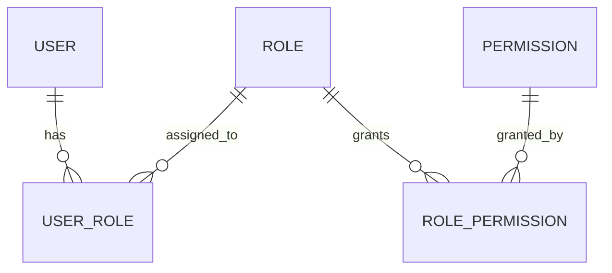

```text
users               (id, tenant_id, name, email, ...)
roles               (id, tenant_id, name)              -- "Sales Manager" — per-tenant
permissions         (id, name)                          -- "sales.orders.approve" — global catalog
user_roles          (user_id, role_id)                   -- many-to-many
role_permissions    (role_id, permission_id)              -- many-to-many
```

Permissions are a fixed, global catalog your code defines; roles are per-tenant named bundles of those permissions, so each tenant can build its own "Sales Manager" out of the same permission set. `PermissionMiddleware` resolves a user's roles → permissions to check a `#[RequiresPermission]` attribute — and since that resolution is a join across four tables, it's cached in Redis per user/session and invalidated on role change, rather than re-joined on every request.

```text
src/Shared/Authorization/
├── Models/
│   ├── Role.php
│   └── Permission.php
├── Repositories/
│   └── PermissionRepository.php     # resolves user → roles → permissions
└── PermissionCache.php                # Redis-backed cache, invalidated on role/permission change
```

---

## 6.4 Database Connection Infrastructure (`Infrastructure/Database/`)

"The ADOdb connection" is really three separate responsibilities, and bundling them into one class makes testing painful — every unit test that touches the database would then need real config, real secrets, and real tenant-resolution logic just to construct a mock connection. Keeping them apart avoids that:

1. **Building the connection** — knows the DSN, credentials (from `secrets/database/`), pgDog's host/port (§ 7.1). Runs once per request.
2. **Setting the tenant context on that connection** — the `SET app.tenant_id = ...` mechanism from § 7. Must happen after the connection exists, before any repository runs a query.
3. **Handing the connection to whatever needs it** — `BaseRepository` needs it in its constructor; this is the per-request wiring that ties the first two together.

```text
src/Infrastructure/Database/
├── ConnectionFactory.php    # Responsibility 1 — builds and returns an ADOConnection
├── TenantContext.php          # Responsibility 2 — SET app.tenant_id on a given connection
└── ConnectionProvider.php      # Responsibility 3 — per-request singleton wiring the above two together
```

### `ConnectionFactory.php`

```php
<?php
declare(strict_types=1);

namespace App\Infrastructure\Database;

final class ConnectionFactory
{
    public function create(): \ADOConnection
    {
        $db = \ADONewConnection('postgres9');

        $db->Connect(
            argHostname: $this->host(),      // pgDog in prod (§ 7.1), postgres directly in local dev
            argUsername: $this->username(),
            argPassword: $this->password(),   // read from a Docker secret file, not an env var directly
            argDatabaseName: $this->database(),
        );

        $db->SetFetchMode(ADODB_FETCH_ASSOC);

        return $db;
    }

    private function host(): string { return getenv('DB_HOST') . ':' . getenv('DB_PORT'); }
    private function username(): string { return getenv('DB_USERNAME'); }
    private function database(): string { return getenv('DB_DATABASE'); }

    private function password(): string
    {
        $path = getenv('DB_PASSWORD_FILE'); // e.g. /run/secrets/db_password (Docker secret mount path)
        return trim(file_get_contents($path));
    }
}
```

The password is read from a **file path**, not an env var directly — this matches how Docker Compose secrets actually work (§ Secrets): a secret is mounted as a file inside the container (typically `/run/secrets/<name>`), and `DB_PASSWORD_FILE` just points at that path. The env var itself never holds the secret value.

### `TenantContext.php`

```php
<?php
declare(strict_types=1);

namespace App\Infrastructure\Database;

final class TenantContext
{
    public function apply(\ADOConnection $db, string $tenantId): void
    {
        // set_config(), not a literal SET app.tenant_id = '...' string — SET doesn't accept
        // bound parameters in Postgres, so building it via interpolation would be a SQL-injection
        // surface. set_config() is a normal function call and accepts parameters like any query.
        $db->Execute('SELECT set_config(?, ?, ?)', ['app.tenant_id', $tenantId, $this->scopeToTransaction()]);
    }

    private function scopeToTransaction(): bool
    {
        // true ('LOCAL')  → setting clears automatically at the next COMMIT — safe under pgDog's
        //                    transaction-pooling mode (§ 7.1), since a pooled connection can serve
        //                    a different tenant's next transaction.
        // false (session)  → setting persists for the whole session — fine only without a pooler,
        //                    or under pgDog's session-pooling mode.
        return true;
    }
}
```

The third argument to `set_config()` is the scoping decision flagged as a caveat in § 7.1: with pgDog in transaction-pooling mode, `true` (`LOCAL`) is the safe choice, since it makes the tenant setting automatically expire at `COMMIT` rather than risking it leaking into a different tenant's next transaction on the same pooled connection.

### `ConnectionProvider.php`

```php
<?php
declare(strict_types=1);

namespace App\Infrastructure\Database;

final class ConnectionProvider
{
    private ?\ADOConnection $connection = null;

    public function __construct(
        private ConnectionFactory $factory,
        private TenantContext $tenantContext,
    ) {}

    public function get(string $tenantId): \ADOConnection
    {
        if ($this->connection === null) {
            $this->connection = $this->factory->create();
        }

        $this->tenantContext->apply($this->connection, $tenantId);

        return $this->connection;
    }

    /**
     * For genuinely tenant-agnostic lookups only — login, registration, host-based
     * tenant resolution (§ 7.0.1). Deliberately skips TenantContext::apply(), so the
     * name makes it obvious at every call site that RLS scoping is intentionally bypassed.
     */
    public function getUnscoped(): \ADOConnection
    {
        if ($this->connection === null) {
            $this->connection = $this->factory->create();
        }

        return $this->connection;
    }
}
```

One `ConnectionProvider` instance lives per request (wired in `Bootstrap/Application.php`) and is reused across every Repository constructed during that request — so a request touching Sales, Inventory, and Finance repositories in one transactional operation (§ 6) doesn't open three separate ADOdb connections.

### How it feeds `BaseRepository`

```php
// Bootstrap/Application.php (or a small DI container setup)
$tenantId = $request->attribute('tenant_id');        // set by TenantResolverMiddleware
$db = $connectionProvider->get($tenantId);              // connection with tenant context already applied
$currentUserId = $request->attribute('user_id');          // set by AuthMiddleware

$salesOrderRepository = new SalesOrderRepository($db, $tenantId, $currentUserId);
```

### Redis — same idea, simpler

```text
src/Infrastructure/Redis/
└── RedisConnectionFactory.php   # builds a Redis client from config/secrets — one class, no tenant equivalent
```

Redis doesn't need a `TenantContext` counterpart at the connection level. Tenant isolation there is handled by namespacing keys per tenant (`tenant:{$tenantId}:cache:...`) at the point of *use* — e.g. § 6.3's `PermissionCache` — rather than at the connection itself.

### PHP sessions: Redis, never ADOdb's `adodb-session2.php`

ADOdb's database-backed session handler (`adodb-session2.php`) does a **locking read** on session load (`SELECT ... FOR UPDATE` or similar) held for the entire request duration, only releasing at `session_write_close()`. Combined with pgDog (§ 7.1), this causes real problems: if the session handler holds a lock on one pooled connection for the whole request while application code also tries to open a business transaction (`StartTrans()`, § 6), it can deadlock against itself or exhaust pgDog's pool under concurrent load — every simultaneous request holding a session lock open for its full duration instead of releasing it quickly.

**The fix: use PHP's native Redis session handler instead — never route sessions through ADOdb at all.**

```php
// Bootstrap/Application.php — before anything else runs
ini_set('session.save_handler', 'redis');
ini_set('session.save_path', 'tcp://redis:6379?auth=' . getenv('REDIS_PASSWORD'));
session_start();
```

Or configured at the php.ini/container level instead of in code:

```ini
; docker/php/conf.d override
session.save_handler = redis
session.save_path = "tcp://redis:6379?auth=your_redis_password"
```

This removes ADOdb from the session path entirely — Redis's own locking (advisory, held only briefly around the read/write) no longer competes with pgDog's connection pool at all, since it's a separate connection to a separate service.

**This is the architecturally correct choice, not just a pgDog workaround.** Storing PHP sessions in the primary transactional database was a debatable fit even before pgDog: sessions are ephemeral and have nothing to do with the durable-data pipeline (`#[Timestamps]`/`#[Auditable]`/RLS/tenant scoping) built throughout this README; a `sessions` table under RLS (§ 7) would need either awkward tenant-scoping or an explicit RLS exception, since a session often exists before a tenant is even resolved (same problem as § 7.0.1's login flow); and Redis already holds the same *category* of ephemeral, request-scoped data via `PermissionCache` (§ 6.3) — sessions belong in the same place.

**Don't confuse this with durable authentication records, which stay in Postgres.** `RefreshTokenSchema`/`LoginAttemptSchema` (`Modules/Authentication/Schemas/`) are genuinely durable, auditable data — a refresh token needs to survive a Redis flush, and "show me all active sessions for this user so they can revoke one" is a real query against durable rows. Keep the two separate: **ephemeral PHP session state → Redis; durable authentication/audit records → Postgres**, unaffected by this change.

```text
src/Infrastructure/Redis/
├── RedisConnectionFactory.php     # existing
└── SessionHandlerConfig.php         # configures PHP's native redis session.save_handler
```

---

## 6.5 Wiring Controllers Without a Factory on Every One (`Shared/Container/`)

Given the `Router` dispatches by instantiating a Controller class directly (`new $route['controller']()`), giving every Controller its Repository dependency would otherwise mean writing a static `::make()` factory method on all 13 modules' worth of controllers — repetitive boilerplate the project doesn't need to accept. A small reflection-based container removes it: the `Router` hands the Controller's class name to the container, which inspects the constructor via Reflection and resolves each dependency automatically — recursively, so a Controller needing a Repository needing an `\ADOConnection` gets wired without anyone writing that chain by hand.

```text
src/Shared/Container/
├── Container.php           # resolves any class by reflecting its constructor
└── ContainerException.php    # thrown when something can't be resolved
```

### `Container.php`

```php
<?php
declare(strict_types=1);

namespace App\Shared\Container;

final class Container
{
    /** @var array<string, mixed> Explicit bindings — for things Reflection can't build on its own */
    private array $bindings = [];

    /** @var array<string, mixed> Already-built singletons — built once per request, reused */
    private array $instances = [];

    /**
     * Register a value or a factory closure for a specific class/interface name, or a
     * scalar parameter name (see the note on scalar parameters below). Use this for
     * things Reflection can't guess — an interface, or a value needing request context
     * (\ADOConnection, tenantId).
     */
    public function bind(string $abstract, \Closure|object|string|null $concrete): void
    {
        $this->bindings[$abstract] = $concrete;
    }

    public function resolve(string $class): object
    {
        if (isset($this->instances[$class])) {
            return $this->instances[$class];
        }

        if (isset($this->bindings[$class])) {
            $binding = $this->bindings[$class];
            $instance = $binding instanceof \Closure ? $binding($this) : $binding;
            return $this->instances[$class] = $instance;
        }

        $reflection = new \ReflectionClass($class);
        $constructor = $reflection->getConstructor();

        if ($constructor === null) {
            return $this->instances[$class] = new $class();
        }

        $arguments = array_map(
            fn(\ReflectionParameter $param) => $this->resolveParameter($param),
            $constructor->getParameters()
        );

        return $this->instances[$class] = $reflection->newInstanceArgs($arguments);
    }

    private function resolveParameter(\ReflectionParameter $param): mixed
    {
        $type = $param->getType();

        if ($type instanceof \ReflectionNamedType && !$type->isBuiltin()) {
            return $this->resolve($type->getName()); // recurse — e.g. Repository needing \ADOConnection
        }

        // Scalar parameter — matched by NAME against string-keyed bindings (e.g. 'tenantId').
        // See the limitation note below — this only works if the parameter name matches exactly.
        if (isset($this->bindings[$param->getName()])) {
            $binding = $this->bindings[$param->getName()];
            return $binding instanceof \Closure ? $binding($this) : $binding;
        }

        if ($param->isDefaultValueAvailable()) {
            return $param->getDefaultValue();
        }

        throw new ContainerException(
            "Cannot resolve parameter '\${$param->getName()}' for "
            . "{$param->getDeclaringClass()?->getName()} — no type-hint, no binding, and no default value."
        );
    }
}
```

```php
<?php
declare(strict_types=1);

namespace App\Shared\Container;

final class ContainerException extends \RuntimeException {}
```

### Wiring it per-request, in `Router`

```php
final class Router {
    // ...existing properties...

    private Container $container;

    function __construct(
        private readonly ?RateLimiterInterface $rateLimiter = new FileRateLimiter(),
    ) {
        $this->container = new Container();
    }

    /**
     * Called once per request, before dispatch — binds everything that needs live
     * request context: the tenant, the connection, the current user.
     */
    public function bootContainerForRequest(Request $request): void
    {
        $tenantId = $request->attribute('tenant_id');
        $currentUserId = $request->attribute('user_id');

        $connectionProvider = new ConnectionProvider(new ConnectionFactory(), new TenantContext());

        $this->container->bind(\ADOConnection::class, fn() => $connectionProvider->get($tenantId));
        $this->container->bind('tenantId', $tenantId);
        $this->container->bind('currentUserId', $currentUserId);
    }

    function runPipeline(array $route, Request $request) : mixed {
        $this->bootContainerForRequest($request);

        // ...existing middleware wiring, unchanged...

        $destination = function(Request $request) use ($route) : mixed {
            $controllerInstance = $this->container->resolve($route['controller']);
            $args = $route['injectsRequest'] ? [$request, ...$request->routeParams] : [...$request->routeParams];

            return $controllerInstance->{$route['action']}(...$args);
        };

        // ...pipeline reduce, unchanged...
        return $pipeline($request);
    }
}
```

### What Controllers and Repositories look like with this in place — zero factory boilerplate

```php
final class SalesOrderController extends BaseController
{
    public function __construct(private SalesOrderRepository $repository) {}
    // No ::make() needed — the container builds this automatically.
}

final class SalesOrderRepository extends BaseRepository
{
    protected function table(): string { return 'sales_orders'; }
    // Constructor inherited from BaseRepository — the container resolves \ADOConnection, tenantId,
    // and currentUserId by walking up to the parent constructor via Reflection, same as any other.
}
```

### The one real limitation: scalar parameters are matched by name, not type

Reflection can read a parameter's *class* type-hint reliably, but `string $tenantId` and `?string $currentUserId` are scalar types with no class to resolve — the container falls back to matching the bound key (`'tenantId'`) against the parameter's literal name (`$tenantId`). This works, but it's a real constraint worth knowing rather than discovering later: every Repository's constructor parameter has to be named exactly `$tenantId`/`$currentUserId` for the binding to find it — a typo or a differently-named parameter silently fails to resolve (or falls through to a default value, if one exists) rather than raising an obvious error at the call site.

### When this is worth it, and the escape hatch when it isn't

Given the project already hand-rolls a Router with attribute-based routing, middleware, and rate limiting, a ~100-line reflection container is consistent with that same philosophy — explicit, one job, no hidden magic to trace through — and it removes a real, repeated cost (13 modules × N controllers each needing a factory method). It stops being the right tool the moment a class needs a constructor argument the container genuinely can't express automatically; at that point, `bind()` with an explicit closure (as already shown for `\ADOConnection`) is the escape hatch, same as overriding `BaseRepository::store()` when the generic `toArray()` mapping doesn't fit a specific table (§ 6.2).

---

## 7. Multi-Tenant Architecture

Tenant isolation is enforced at the database level via PostgreSQL Row-Level Security — not only in application code.

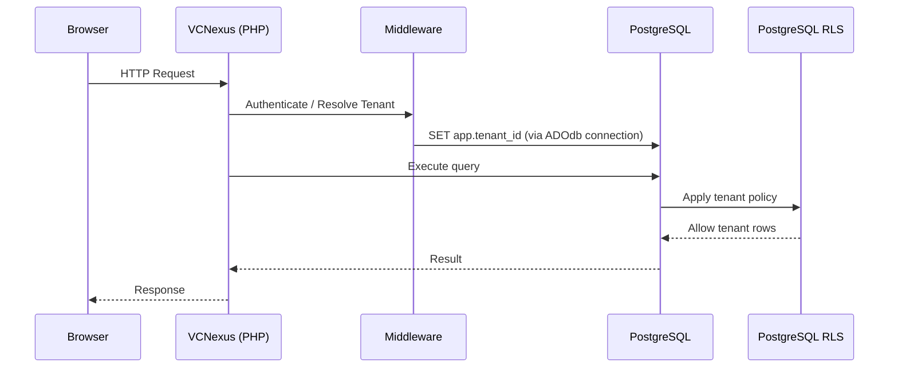

Since there's no framework-level connection pooling abstraction, the tenant context (`SET app.tenant_id = ...`) must be set on the ADOdb connection at the very start of each request, before any tenant-scoped query runs — likely in a small middleware step in `Bootstrap/`.

---

## 7.0.1 Resolving the Tenant — and the Routes That Don't Have One Yet

`TenantResolverMiddleware` assumes a tenant can be resolved on every request — but login is the one endpoint where that's backwards: the tenant isn't known *until after* the user authenticates. Feeding a `null` tenant into `TenantContext::apply()` would be silently dangerous, since it feeds straight into `set_config('app.tenant_id', ...)` for RLS — a `null` there either breaks the query or, in the wrong RLS policy configuration, quietly returns zero rows instead of failing loudly.

### Routes without a tenant yet don't get the middleware attached

This is a routing decision, not something the middleware should paper over. Login/register routes simply never have `TenantResolverMiddleware` attached — global middleware registration is the wrong place for it, since a global middleware runs on every route including login:

```php
#[Route(path: '/auth')]
final class AuthController extends BaseController
{
    // No #[Middleware(TenantResolverMiddleware::class)] here — correct, there's no tenant yet.
    #[Route(path: '/login', methods: ['POST'])]
    public function login(Request $request): Response { /* ... */ }
}

#[Middleware(AuthMiddleware::class)]
#[Middleware(TenantResolverMiddleware::class)]   // every tenant-scoped module needs this
final class SalesOrderController extends BaseController
{
    // ...
}
```

### `TenantResolverMiddleware` fails loudly on a missing tenant, as a second safety layer

Even with correct routing, this is a cheap safety net against ever accidentally attaching the middleware somewhere it shouldn't be:

```php
final class TenantResolverMiddleware implements MiddlewareInterface
{
    public function __construct(
        private UserRepository $userRepository,
        private TenantRepository $tenantRepository,
    ) {}

    public function handle(Request $request, \Closure $next): mixed
    {
        $tenantId = $this->resolveTenantId($request);

        if ($tenantId === null) {
            // Never proceed with a null tenant — better a clear 400 than a silent RLS gap.
            return Response::json(['error' => 'Tenant could not be resolved for this request'], 400);
        }

        $request = $request->withAttribute('tenant_id', $tenantId);
        return $next($request);
    }

    /**
     * Two resolution strategies, tried in order: host/subdomain first (works pre-auth,
     * for routes where the tenant is known from the URL), falling back to the
     * authenticated user's own tenant (for routes with no subdomain-based routing).
     */
    private function resolveTenantId(Request $request): ?string
    {
        return $this->resolveFromHost($request) ?? $this->resolveFromUser($request);
    }

    /**
     * <tenant>.vcnexus.com — the tenant is known directly from the URL, before auth
     * even runs. Uses an unscoped connection since there's no tenant_id to scope by yet.
     */
    private function resolveFromHost(Request $request): ?string
    {
        $host = $request->headers['Host'] ?? '';
        $subdomain = explode('.', $host)[0] ?? null;

        if ($subdomain === null || $subdomain === 'www') {
            return null; // no subdomain, or a non-tenant host — fall through to user-based resolution
        }

        return $this->tenantRepository->findIdBySlugUnscoped($subdomain);
    }

    /**
     * Fallback for routes with no subdomain-based routing — the tenant is a property
     * of the logged-in user. Requires AuthMiddleware to have already run and set 'user_id'.
     */
    private function resolveFromUser(Request $request): ?string
    {
        $userId = $request->attribute('user_id'); // set by AuthMiddleware, which must run first

        if ($userId === null) {
            return null;
        }

        $user = $this->userRepository->findByIdUnscoped($userId);
        return $user?->tenantId;
    }
}
```

Trying the host first means this middleware also works correctly on routes where the subdomain establishes the tenant *before* `AuthMiddleware` has run — falling back to the user lookup only when there's no tenant-identifying subdomain present.

### The wrinkle this exposes: some lookups genuinely can't be tenant-scoped yet

Both `findIdBySlugUnscoped()` and `findByIdUnscoped()` — plus `AuthController::login()`'s own `findByEmail()` lookup — share the same constraint: they run *before* a tenant is known, so they can't go through the normal `ConnectionProvider::get($tenantId)` path. `ConnectionProvider` needs an explicit unscoped variant for exactly this:

```php
// Infrastructure/Database/ConnectionProvider.php — addition
public function getUnscoped(): \ADOConnection
{
    if ($this->connection === null) {
        $this->connection = $this->factory->create();
    }

    return $this->connection; // deliberately skips $this->tenantContext->apply()
}
```

The name `getUnscoped()` is deliberate — it makes it obvious at every call site that RLS tenant-scoping is intentionally bypassed, so it should only ever be reached for from genuinely tenant-agnostic code (login, registration, host-based tenant lookup) — never out of convenience inside a regular module's Repository. This also means `users` needs `email` to be globally unique across all tenants (not per-tenant) — worth checking against the `#[Unique(name: 'uq_users_email', columns: ['email'])]` constraint from the `UserSchema` example (§ 4): since it's table-wide, not `(tenant_id, email)`, this lookup is safe and unambiguous without RLS filtering.

---

## 7.1 Connection Pooling (pgDog / PgBouncer)

A connection pooler sits **between** the PHP app and PostgreSQL — it's a proxy, not a library the app calls. That makes it almost entirely a `docker/` + `docker-compose.yml` concern, with one small config change in `Infrastructure/Database/`. It does not touch `Shared/Schema/`, modules, or migrations — pooling is orthogonal to schema/ORM concerns.

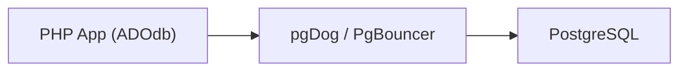

### Where it lives

```text
docker/
├── nginx/
├── php/
├── postgres/
├── pgdog/                    # pgDog config, sibling to postgres/
│   └── pgdog.toml             # pool_size, pooling mode, routing rules
└── redis/

src/Infrastructure/Database/
└── ConnectionFactory.php     # only change here: DB_HOST/DB_PORT now point at pgDog, not Postgres directly
```

```yaml
# docker-compose.yml
services:
  pgdog:
    image: ghcr.io/pgdog-dev/pgdog:latest   # check current image/tag
    volumes:
      - ./docker/pgdog/pgdog.toml:/etc/pgdog/pgdog.toml
    secrets:
      - db_password
    ports:
      - "6432:6432"
    depends_on:
      - postgres

  app:
    environment:
      DB_HOST: pgdog        # was: postgres
      DB_PORT: 6432          # pgDog's listen port, not Postgres' 5432
    depends_on:
      - pgdog
```

### The one real interaction with this architecture: tenant context + pooling mode

This is worth being deliberate about, since RLS is the actual tenant-isolation mechanism here, not just app logic:

- **Transaction pooling mode** (most efficient, pgDog's typical default) — a connection is returned to the pool between transactions, so a session-level `SET app.tenant_id` can leak into a *different* tenant's next transaction on that same physical connection if it isn't scoped correctly. Because business operations already wrap in `StartTrans()`/`CompleteTrans()` (see § 6), the safe pattern is setting `app.tenant_id` **inside that same transaction**, immediately after `StartTrans()` — so the setting only lives as long as the transaction currently occupying that pooled connection.
- **Session pooling mode** — a connection stays dedicated to one client for the life of its session, so this leak risk doesn't apply, at the cost of less efficient pooling.

Don't assume the pooler's default mode is safe for a multi-tenant RLS setup without testing it explicitly — this is worth verifying before Phase 2 (Core ERP), since every tenant-scoped query depends on it.

| | Changes? |
|---|---|
| `docker/pgdog/` config | New |
| `docker-compose.yml` | New service + env var change |
| `Infrastructure/Database/ConnectionFactory.php` | Config values only (host/port) |
| Modules, Services, Repositories | No change |
| `Shared/Schema/` | No change |
| Tenant-context-setting *timing* | Needs verification against pooling mode |

---

## 8. Tenant Data Model

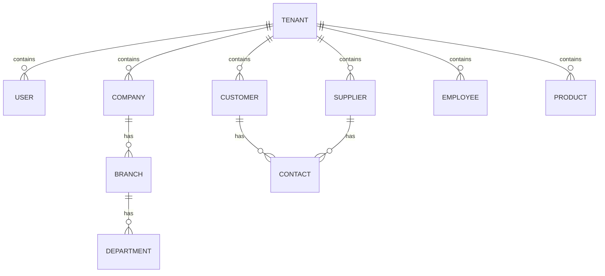

```text
Tenant
  │
  ├── Users
  ├── Companies
  ├── Customers
  ├── Suppliers
  ├── Employees
  ├── Products
  ├── Sales
  ├── Purchases
  └── Financial records
```

Every tenant-owned table needs a `tenant_id` column and an RLS policy against it.

---

## 9. Business Modules

```text
Dashboard
Organization
People
CRM
Sales
Purchasing
Inventory
Finance
Projects
HR
Documents
Reports
Administration
```

### Module scopes at a glance

**Organization** — Companies, Branches, Departments, Addresses, Organization Settings.

**People** — Customers, Suppliers, Employees, Contacts, Addresses. One shared identity model so a customer isn't recreated per module; the same person/company record participates in CRM, Sales, Invoices, Receivables, Documents, and Activities.

**CRM** (kept small) — Leads, Opportunities, Activities, Notes, Interaction History.

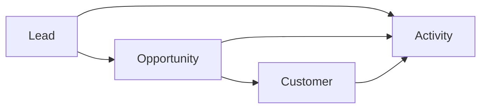

**Sales** — connects Customers, Inventory, and Finance:

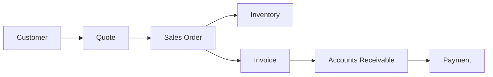

**Purchasing** — connects Suppliers, Approvals, Inventory, and Finance:

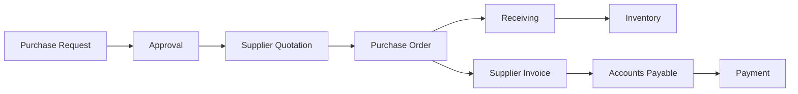

**Inventory** — driven by stock **movements**, never a bare quantity update:

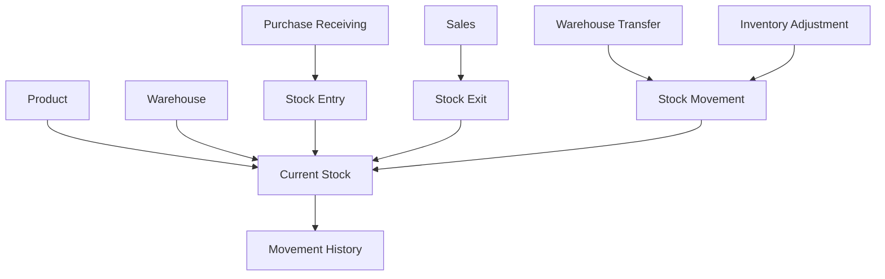

Scope: Products, Categories, Warehouses, Locations, Stock, Stock Movements, Transfers, Adjustments, Inventory Counts, Minimum Stock.

**Finance** — a central module; records are created as a consequence of business operations:

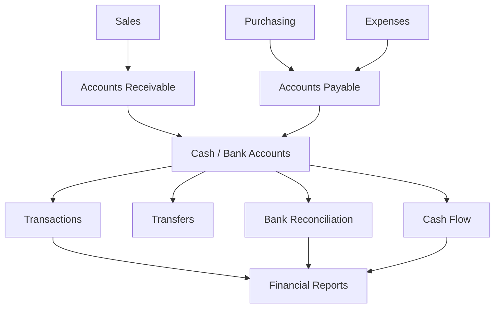

Initial scope: Accounts Receivable, Accounts Payable, Cash Accounts, Transactions, Transfers, Categories, Cost Centers, Recurring Transactions, Payment Methods, Bank Reconciliation, Cash Flow.

**Projects** — reuses Employee and time-tracking data:

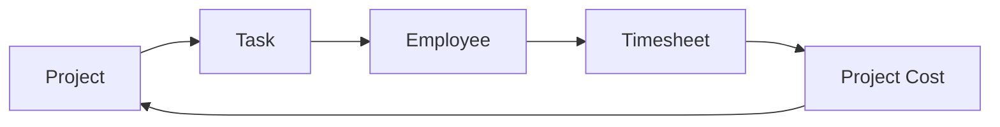

**Shared Services** — used by every module instead of each reimplementing its own version:

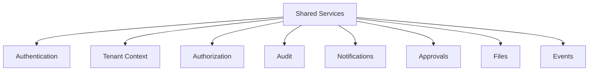

For example, Sales must not implement its own audit trail while Purchasing implements another — both call the same shared audit service.

---

## 10. Frontend Architecture

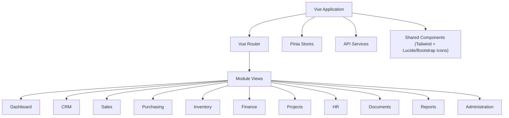

The frontend module boundaries mirror the backend's. Use Lucide Vue as the default icon set for UI chrome, and Bootstrap Icons where a wider icon selection is needed (e.g. domain-specific glyphs Lucide doesn't cover).

---

## 11. Backend Request Flow

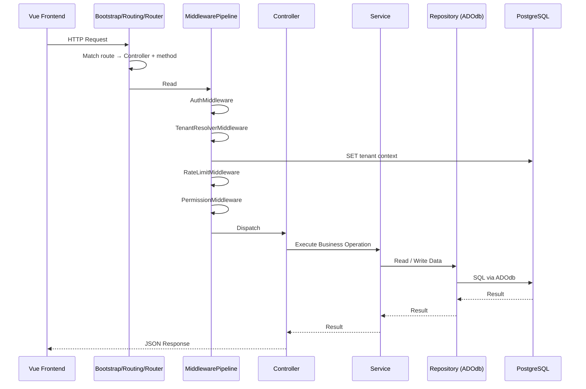

Middleware classes themselves live in `Shared/Http/Middleware/` (reusable across every module); the pipeline that reflects on a controller's attributes and runs them in order lives in `Bootstrap/Routing/MiddlewarePipeline.php`, since it's part of the dispatch mechanism, not reusable business infrastructure.

---

## 11.1 Realtime / WebSockets (Ratchet)

A WebSocket server is a **new entry point into the same codebase**, not a separate application — same reasoning as the modular monolith itself: it needs the same `Shared/Notifications/`, `Shared/Http/` auth, and `Shared/Schema/` models as everything else, so splitting it into its own repo would mean duplicating that shared code or building an internal API just to re-access it.

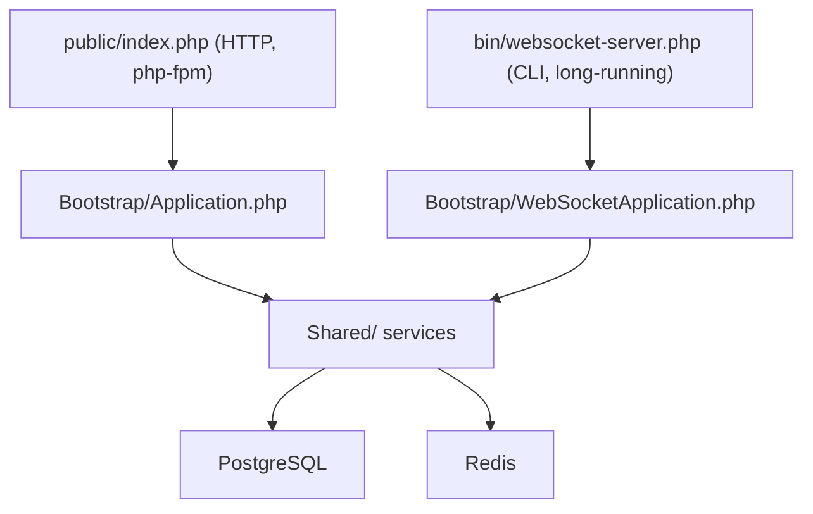

### Where it lives

```text
src/
├── Bootstrap/
│   ├── Application.php              # existing HTTP entry point
│   └── WebSocketApplication.php     # NEW — boots Ratchet, wires it to Shared/ services
│
├── Realtime/                         # NEW — treated as its own concern, same level as Bootstrap
│   ├── Server.php                     # Ratchet\App setup, port binding
│   ├── Connections/
│   │   └── ConnectionManager.php       # tracks connected clients, tenant/user mapping
│   └── Handlers/                       # one handler per "channel" of realtime events
│       ├── NotificationHandler.php
│       └── SalesOrderHandler.php        # e.g. broadcast order-status changes to Sales views
│
└── Modules/
    └── Sales/
        └── Services/
            └── SalesOrderService.php    # after CompleteTrans(), calls into Realtime/ to broadcast

bin/
└── websocket-server.php              # CLI entry point — thin, mirrors public/index.php
```

`bin/websocket-server.php` is the CLI equivalent of `public/index.php` — as thin as possible, just bootstraps and hands off:

```php
#!/usr/bin/env php
<?php
require __DIR__ . '/../vendor/autoload.php';

$app = new \VCNexus\Bootstrap\WebSocketApplication();
$app->run();
```

### Docker — same image, different command, new service

Since it's built from the **same Dockerfile** as the `app` (php-fpm) service, there's zero code duplication — it's the same container image, just started with a different command:

```yaml
services:
  app:              # existing php-fpm, handles HTTP
    # ...

  websocket:        # NEW — long-running CLI process, same codebase
    build:
      context: .
      dockerfile: docker/php/Dockerfile   # same PHP image as app
    command: php bin/websocket-server.php
    ports:
      - "8080:8080"
    depends_on:
      - redis
      - pgdog
    secrets:
      - db_password
```

Nginx doesn't proxy this by default — the Vue frontend connects to it directly (`ws://localhost:8080`), or you front it with Nginx's WebSocket proxying support if you want it behind the same domain.

### Why not a separate project

A separate repo/service makes sense once the realtime layer needs to scale independently of HTTP traffic (e.g. thousands of persistent connections while HTTP load stays modest) or is owned by a different team with its own release cadence. Neither applies at this stage — paying for a service boundary (network calls instead of function calls, a bespoke internal API, a separate deploy pipeline) isn't worth it for a feature that's still core to the same product. The module boundaries already in place make that extraction possible later if it's ever needed, same as the closing architecture principle in § 16.

---

## 12. Complete Sales Example

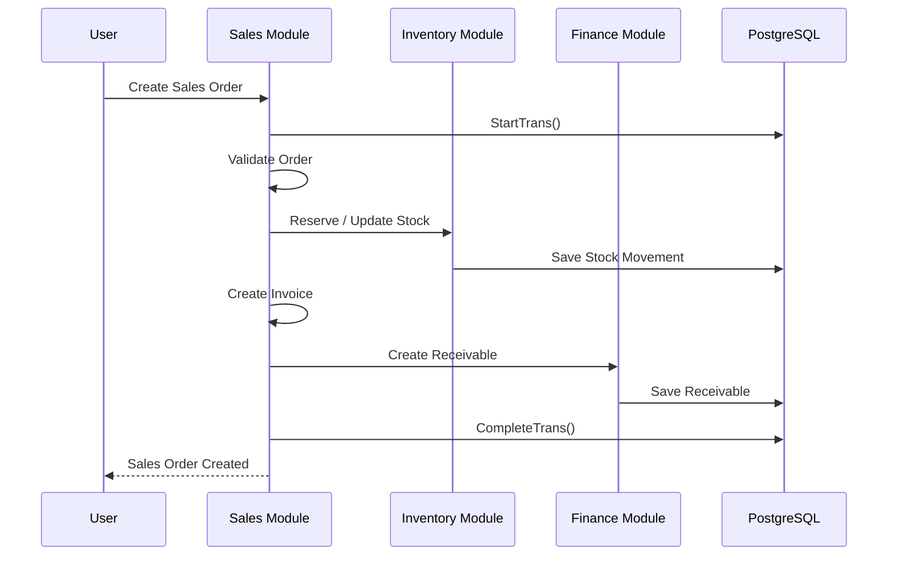

## 13. Complete Purchasing Example

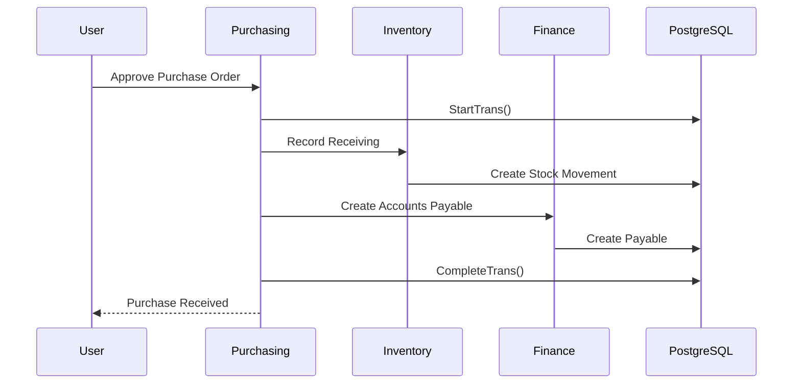

---

## 14. Brazilian Fiscal Module (Future)

Added only once there's a clear need — NF-e / NFS-e / NFC-e / SEFAZ integration is complex enough to deserve its own module rather than being scattered across Sales and Finance.

```mermaid
flowchart LR
    SALES["Sales"] --> FISCAL["Fiscal"] --> INVOICE["Fiscal Document"]
    SALES --> FINANCE["Finance"]
    SALES --> INVENTORY["Inventory"]
```

Future scope: NF-e, NFS-e, NFC-e, XML, Tax Configuration, Fiscal Rules, SEFAZ integrations.

---

## 15. Recommended Development Order

### Phase 1 — Platform
```text
Docker environment (Nginx, PHP-FPM 8.4, PostgreSQL, Redis)
Hand-rolled router + front controller
Multi-tenancy (RLS setup)
Authentication
Users, Roles, Permissions
Tenant Context middleware
Audit
Notifications
Attachments
Settings
```

### Phase 2 — Core ERP
```text
People (Customers, Suppliers, base identity)
Products
Inventory
Sales
Purchasing
Finance
```

### Phase 3 — Operations
```text
Projects, Tasks
Employees, Attendance, Timesheets
Approvals
Documents
```

### Phase 4 — Management
```text
Dashboard
Reports, Analytics
Import / Export
Scheduled Reports
```

### Phase 5 — Brazil-specific
```text
Fiscal Data, NF-e, NFS-e, NFC-e, XML
Tax Configuration
Fiscal Integrations
```

**Future modules** (add only on real demand): Accounting, Payroll, Manufacturing, Fleet, Maintenance, Helpdesk, E-commerce, POS.

---

## 16. Architecture Principle

> Keep one application, but don't let everything depend on everything else.

Each module has one job:

```text
Sales       → Selling things
Purchasing  → Buying things
Inventory   → Tracking things
Finance     → Tracking money
HR          → Managing employees
Projects    → Managing work
CRM         → Managing prospects and relationships
Reports     → Presenting information
```

Shared stays shared: Authentication, Tenant Context, Permissions, Audit, Notifications, Documents, Approvals.

VCNexus can stay a monolith for a long time. If a module ever needs to become its own service, clear boundaries make that migration possible later — without paying the cost of microservices from day one.

---

## Getting Started

Nothing exists yet. Suggested first steps:

1. **Scaffold Docker.** `docker-compose.yml` with services for `nginx`, `php` (8.4-fpm image + ADOdb via Composer), `postgres`, `redis`.
2. **Bootstrap the PHP entry point.** A single `public/index.php` front controller, a minimal router in `Bootstrap/Routing/`, and a PSR-4 autoloader via Composer (no framework — just autoloading and a router).
3. **Set up ADOdb.** Connection factory in `Infrastructure/Database/`, wired to read tenant context per-request.
4. **Enable PostgreSQL RLS early** — retrofitting tenant isolation later is much more painful than building tables with `tenant_id` + policies from day one.
5. **Scaffold Vue.** Vite + Vue 3 + TailwindCSS + Vue Router + Pinia; add `lucide-vue-next` and `bootstrap-icons`.
6. **Build Phase 1 (Platform)** end-to-end — auth, tenant context, users/roles/permissions — before touching any ERP module. Every later module depends on this being solid.
7. **Pick one flow (Sales) and build it vertically** — Controller → Service → Repository → DB, with a real `StartTrans()`/`CompleteTrans()` transaction — before replicating the pattern across other modules.
